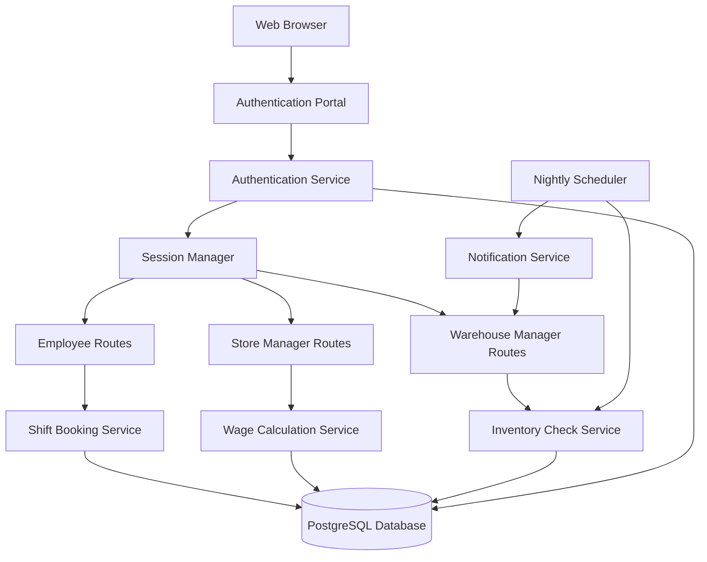
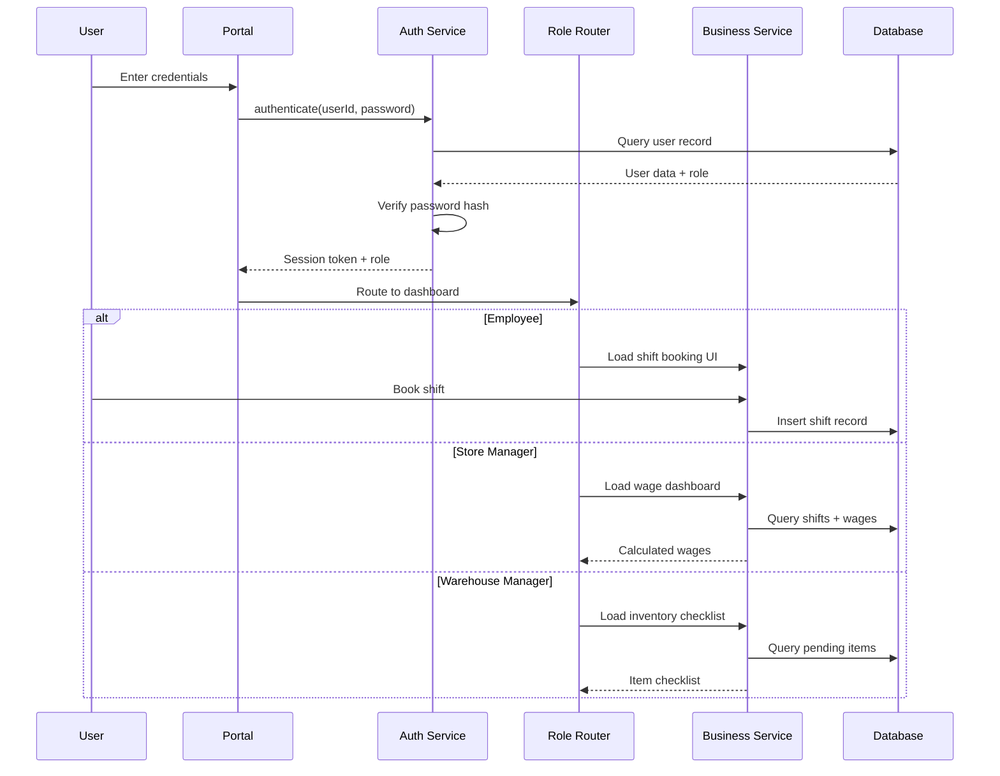

# Design Document: Employee Management System

## Overview

The Employee Management System is a web-based application for managing retail store operations across three user roles: employees, store managers, and warehouse managers. The system provides role-based authentication, shift booking for employees, wage calculation dashboards for store managers, and automated inventory check-list distribution for warehouse managers. Built on Node.js/Express with PostgreSQL, the system integrates with the existing retail shop infrastructure to provide comprehensive workforce and inventory management capabilities.

The architecture follows a three-tier model with a presentation layer (EJS templates), application layer (Express middleware and route handlers), and data layer (PostgreSQL with pg driver). Authentication is session-based with bcrypt password hashing. The system includes a scheduled job service for automated nightly inventory list generation and distribution.

## Architecture



## Main Workflow




## Components and Interfaces

### Component 1: Authentication Service

**Purpose**: Handles user authentication, password verification, and session management for all three user roles.

**Interface**:
```javascript
/**
 * @typedef {Object} AuthResult
 * @property {boolean} success - Whether authentication was successful
 * @property {string} [sessionToken] - Session token if successful
 * @property {string} [userRole] - User's role (employee, store_manager, warehouse_manager)
 * @property {string} [userId] - User's ID if successful
 * @property {string} [error] - Error message if failed
 */

/**
 * @typedef {Object} SessionData
 * @property {string} userId - User's ID
 * @property {string} userRole - User's role
 * @property {Date} createdAt - When session was created
 * @property {Date} expiresAt - When session expires
 */

/**
 * Authentication Service
 */
const AuthenticationService = {
  /**
   * Authenticate a user with credentials
   * @param {string} userId - User's login identifier
   * @param {string} password - User's password
   * @returns {Promise<AuthResult>}
   */
  authenticate: async (userId, password) => {},
  
  /**
   * Verify a session token
   * @param {string} sessionToken - Session token to verify
   * @returns {Promise<SessionData>}
   */
  verifySession: async (sessionToken) => {},
  
  /**
   * Logout and invalidate session
   * @param {string} sessionToken - Session token to invalidate
   * @returns {Promise<void>}
   */
  logout: async (sessionToken) => {},
  
  /**
   * Hash a password using bcrypt
   * @param {string} password - Plain text password
   * @returns {Promise<string>}
   */
  hashPassword: async (password) => {}
}

// User role constants
const UserRole = {
  EMPLOYEE: 'employee',
  STORE_MANAGER: 'store_manager',
  WAREHOUSE_MANAGER: 'warehouse_manager'
}
```

**Responsibilities**:
- Validate user credentials against database
- Hash and compare passwords using bcrypt
- Generate and manage session tokens
- Enforce session expiration policies
- Route users to appropriate dashboards based on role


### Component 2: Shift Booking Service

**Purpose**: Manages employee shift scheduling, availability tracking, and booking validation.

**Interface**:
```javascript
/**
 * @typedef {Object} Shift
 * @property {string} id - Shift ID
 * @property {Date} startTime - Shift start time
 * @property {Date} endTime - Shift end time
 * @property {string} storeLocation - Store location identifier
 * @property {boolean} isBooked - Whether shift is booked
 * @property {string} [bookedBy] - Employee ID who booked (if applicable)
 * @property {number} capacity - Maximum employees per shift
 * @property {number} currentBookings - Current number of bookings
 */

/**
 * @typedef {Object} BookingResult
 * @property {boolean} success - Whether booking was successful
 * @property {string} [shiftId] - Shift ID if successful
 * @property {string} [error] - Error message if failed
 */

/**
 * Shift Booking Service
 */
const ShiftBookingService = {
  /**
   * Get available shifts in date range
   * @param {Date} startDate - Start date
   * @param {Date} endDate - End date
   * @returns {Promise<Shift[]>}
   */
  getAvailableShifts: async (startDate, endDate) => {},
  
  /**
   * Book a shift for an employee
   * @param {string} employeeId - Employee ID
   * @param {string} shiftId - Shift ID
   * @returns {Promise<BookingResult>}
   */
  bookShift: async (employeeId, shiftId) => {},
  
  /**
   * Cancel a shift booking
   * @param {string} employeeId - Employee ID
   * @param {string} shiftId - Shift ID
   * @returns {Promise<boolean>}
   */
  cancelShift: async (employeeId, shiftId) => {},
  
  /**
   * Get employee's shifts in date range
   * @param {string} employeeId - Employee ID
   * @param {Date} startDate - Start date
   * @param {Date} endDate - End date
   * @returns {Promise<Shift[]>}
   */
  getEmployeeShifts: async (employeeId, startDate, endDate) => {}
}
```

**Responsibilities**:
- Display available work slots/shifts to employees
- Validate shift availability and capacity constraints
- Record shift bookings with employee associations
- Prevent double-booking and capacity violations
- Track shift history for wage calculations


### Component 3: Wage Calculation Service

**Purpose**: Calculates employee wages based on worked shifts and hourly rates for store manager dashboard.

**Interface**:
```javascript
/**
 * @typedef {Object} ShiftWage
 * @property {string} shiftId - Shift ID
 * @property {Date} date - Shift date
 * @property {number} hoursWorked - Hours worked in shift
 * @property {number} wageEarned - Wage earned for shift
 */

/**
 * @typedef {Object} WageReport
 * @property {string} employeeId - Employee ID
 * @property {string} employeeName - Employee's full name
 * @property {number} totalHours - Total hours worked
 * @property {number} hourlyRate - Employee's hourly rate
 * @property {number} totalWages - Total wages earned
 * @property {Date} periodStart - Start of wage period
 * @property {Date} periodEnd - End of wage period
 * @property {ShiftWage[]} shiftBreakdown - Breakdown by shift
 */

/**
 * Wage Calculation Service
 */
const WageCalculationService = {
  /**
   * Calculate wages for single employee
   * @param {string} employeeId - Employee ID
   * @param {Date} startDate - Start date
   * @param {Date} endDate - End date
   * @returns {Promise<WageReport>}
   */
  calculateEmployeeWages: async (employeeId, startDate, endDate) => {},
  
  /**
   * Calculate wages for all employees
   * @param {Date} startDate - Start date
   * @param {Date} endDate - End date
   * @returns {Promise<WageReport[]>}
   */
  calculateAllWages: async (startDate, endDate) => {},
  
  /**
   * Get employee's hourly rate
   * @param {string} employeeId - Employee ID
   * @returns {Promise<number>}
   */
  getEmployeeHourlyRate: async (employeeId) => {},
  
  /**
   * Update employee's hourly rate
   * @param {string} employeeId - Employee ID
   * @param {number} newRate - New hourly rate
   * @returns {Promise<boolean>}
   */
  updateHourlyRate: async (employeeId, newRate) => {}
}
```

**Responsibilities**:
- Query employee shifts within specified date ranges
- Calculate hours worked per shift (end time - start time)
- Multiply hours by employee hourly wage rate
- Aggregate wages across all employees for dashboard display
- Provide detailed wage breakdowns per employee


### Component 4: Inventory Check Service

**Purpose**: Manages automated generation and distribution of daily inventory checklists for warehouse managers.

**Interface**:
```javascript
/**
 * @typedef {Object} ChecklistItem
 * @property {string} id - Item ID
 * @property {string} productId - Product ID
 * @property {string} productName - Product name
 * @property {number} expectedQuantity - Expected quantity
 * @property {number} [actualQuantity] - Actual quantity received
 * @property {string} status - Status (pending, arrived, missing, partial)
 * @property {string} [notes] - Optional notes
 */

/**
 * @typedef {Object} InventoryChecklist
 * @property {string} id - Checklist ID
 * @property {Date} date - Date for checklist
 * @property {string} warehouseManagerId - Warehouse manager ID
 * @property {ChecklistItem[]} items - Checklist items
 * @property {Date} generatedAt - When checklist was generated
 * @property {Date} [completedAt] - When checklist was completed
 */

/**
 * Inventory Check Service
 */
const InventoryCheckService = {
  /**
   * Generate daily checklist
   * @param {Date} date - Date to generate checklist for
   * @returns {Promise<InventoryChecklist>}
   */
  generateDailyChecklist: async (date) => {},
  
  /**
   * Get checklist for warehouse manager
   * @param {string} warehouseManagerId - Warehouse manager ID
   * @param {Date} date - Date
   * @returns {Promise<InventoryChecklist>}
   */
  getChecklist: async (warehouseManagerId, date) => {},
  
  /**
   * Mark checklist item as checked
   * @param {string} checklistId - Checklist ID
   * @param {string} itemId - Item ID
   * @param {string} status - Status (arrived, missing, partial)
   * @returns {Promise<boolean>}
   */
  markItemChecked: async (checklistId, itemId, status) => {},
  
  /**
   * Get checklist history
   * @param {string} warehouseManagerId - Warehouse manager ID
   * @param {Date} startDate - Start date
   * @param {Date} endDate - End date
   * @returns {Promise<InventoryChecklist[]>}
   */
  getChecklistHistory: async (warehouseManagerId, startDate, endDate) => {}
}

// Check status constants
const CheckStatus = {
  PENDING: 'pending',
  ARRIVED: 'arrived',
  MISSING: 'missing',
  PARTIAL: 'partial'
}
```

**Responsibilities**:
- Generate daily inventory checklists based on expected deliveries
- Schedule automated checklist creation nightly for next morning
- Associate checklists with warehouse managers
- Track item-by-item verification status
- Maintain historical checklist records


### Component 5: Scheduler Service

**Purpose**: Executes scheduled tasks including nightly inventory checklist generation.

**Interface**:
```javascript
/**
 * @typedef {Object} JobStatus
 * @property {string} jobName - Job name
 * @property {boolean} isActive - Whether job is active
 * @property {Date} [lastRun] - Last run time
 * @property {Date} [nextRun] - Next run time
 * @property {string} status - Status (success, failed, pending)
 */

/**
 * Scheduler Service
 */
const SchedulerService = {
  /**
   * Schedule a nightly job
   * @param {string} jobName - Job name
   * @param {string} time - Cron time string
   * @param {Function} handler - Async handler function
   * @returns {void}
   */
  scheduleNightlyJob: (jobName, time, handler) => {},
  
  /**
   * Cancel a scheduled job
   * @param {string} jobName - Job name
   * @returns {boolean}
   */
  cancelJob: (jobName) => {},
  
  /**
   * Get job status
   * @param {string} jobName - Job name
   * @returns {JobStatus}
   */
  getJobStatus: (jobName) => {}
}
```

**Responsibilities**:
- Schedule recurring jobs using node-cron or similar
- Execute inventory checklist generation nightly
- Handle job failures and retries
- Log job execution history
- Notify warehouse managers when checklists are ready


## Data Models

### Model 1: User

```javascript
/**
 * @typedef {Object} User
 * @property {string} id - UUID primary key
 * @property {string} userId - Unique login identifier
 * @property {string} passwordHash - bcrypt hashed password
 * @property {string} role - employee, store_manager, or warehouse_manager
 * @property {string} firstName - First name
 * @property {string} lastName - Last name
 * @property {string} email - Email address
 * @property {string} [phoneNumber] - Phone number (optional)
 * @property {number} [hourlyWage] - Hourly wage for employees only
 * @property {Date} createdAt - Creation timestamp
 * @property {Date} updatedAt - Update timestamp
 * @property {boolean} isActive - Whether user is active
 */
```

**Validation Rules**:
- userId must be unique and non-empty
- passwordHash must be bcrypt hash (60 characters)
- role must be one of three valid enum values
- email must be valid email format
- hourlyWage must be positive number if role is employee
- isActive defaults to true

**Database Table**:
```sql
CREATE TABLE users (
  id UUID PRIMARY KEY DEFAULT gen_random_uuid(),
  user_id VARCHAR(100) UNIQUE NOT NULL,
  password_hash CHAR(60) NOT NULL,
  role VARCHAR(20) NOT NULL CHECK (role IN ('employee', 'store_manager', 'warehouse_manager')),
  first_name VARCHAR(100) NOT NULL,
  last_name VARCHAR(100) NOT NULL,
  email VARCHAR(255) UNIQUE NOT NULL,
  phone_number VARCHAR(20),
  hourly_wage NUMERIC(10, 2) CHECK (hourly_wage > 0),
  created_at TIMESTAMP DEFAULT CURRENT_TIMESTAMP,
  updated_at TIMESTAMP DEFAULT CURRENT_TIMESTAMP,
  is_active BOOLEAN DEFAULT true
);

CREATE INDEX idx_users_user_id ON users(user_id);
CREATE INDEX idx_users_role ON users(role);
```


### Model 2: Shift

```javascript
/**
 * @typedef {Object} Shift
 * @property {string} id - UUID primary key
 * @property {Date} startTime - Shift start timestamp
 * @property {Date} endTime - Shift end timestamp
 * @property {string} storeLocation - Store identifier
 * @property {number} capacity - Max employees per shift
 * @property {Date} createdAt - Creation timestamp
 * @property {Date} updatedAt - Update timestamp
 */
```

**Validation Rules**:
- startTime must be before endTime
- startTime must be in the future when creating new shifts
- capacity must be positive integer
- storeLocation must be non-empty

**Database Table**:
```sql
CREATE TABLE shifts (
  id UUID PRIMARY KEY DEFAULT gen_random_uuid(),
  start_time TIMESTAMP NOT NULL,
  end_time TIMESTAMP NOT NULL,
  store_location VARCHAR(100) NOT NULL,
  capacity INTEGER NOT NULL CHECK (capacity > 0),
  created_at TIMESTAMP DEFAULT CURRENT_TIMESTAMP,
  updated_at TIMESTAMP DEFAULT CURRENT_TIMESTAMP,
  CONSTRAINT check_shift_times CHECK (end_time > start_time)
);

CREATE INDEX idx_shifts_time_range ON shifts(start_time, end_time);
CREATE INDEX idx_shifts_location ON shifts(store_location);
```


### Model 3: ShiftBooking

```javascript
/**
 * @typedef {Object} ShiftBooking
 * @property {string} id - UUID primary key
 * @property {string} shiftId - Foreign key to shifts
 * @property {string} employeeId - Foreign key to users
 * @property {string} bookingStatus - Status (confirmed, completed, cancelled, no_show)
 * @property {Date} bookedAt - When booking was made
 * @property {Date} [cancelledAt] - When booking was cancelled (if applicable)
 */
```

// Booking status constants
const BookingStatus = {
  CONFIRMED: 'confirmed',
  COMPLETED: 'completed',
  CANCELLED: 'cancelled',
  NO_SHOW: 'no_show'
}

**Validation Rules**:
- shiftId must reference existing shift
- employeeId must reference user with employee role
- Cannot have duplicate (shiftId, employeeId) with status 'confirmed'
- cancelledAt must be set if status is 'cancelled'

**Database Table**:
```sql
CREATE TABLE shift_bookings (
  id UUID PRIMARY KEY DEFAULT gen_random_uuid(),
  shift_id UUID NOT NULL REFERENCES shifts(id) ON DELETE CASCADE,
  employee_id UUID NOT NULL REFERENCES users(id) ON DELETE CASCADE,
  booking_status VARCHAR(20) NOT NULL CHECK (booking_status IN ('confirmed', 'completed', 'cancelled', 'no_show')),
  booked_at TIMESTAMP DEFAULT CURRENT_TIMESTAMP,
  cancelled_at TIMESTAMP,
  UNIQUE(shift_id, employee_id, booking_status) WHERE booking_status = 'confirmed'
);

CREATE INDEX idx_bookings_shift ON shift_bookings(shift_id);
CREATE INDEX idx_bookings_employee ON shift_bookings(employee_id);
CREATE INDEX idx_bookings_status ON shift_bookings(booking_status);
```


### Model 4: InventoryChecklist

```javascript
/**
 * @typedef {Object} InventoryChecklist
 * @property {string} id - UUID primary key
 * @property {Date} checkDate - Date checklist is for
 * @property {string} warehouseManagerId - Foreign key to users
 * @property {Date} generatedAt - When checklist was created
 * @property {Date} [completedAt] - When fully checked
 * @property {string} status - Status (pending, in_progress, completed)
 */
```

// Checklist status constants
const ChecklistStatus = {
  PENDING: 'pending',
  IN_PROGRESS: 'in_progress',
  COMPLETED: 'completed'
}

**Validation Rules**:
- checkDate must be future or current date when generated
- warehouseManagerId must reference user with warehouse_manager role
- completedAt must be set if status is 'completed'
- Only one active checklist per warehouse manager per date

**Database Table**:
```sql
CREATE TABLE inventory_checklists (
  id UUID PRIMARY KEY DEFAULT gen_random_uuid(),
  check_date DATE NOT NULL,
  warehouse_manager_id UUID NOT NULL REFERENCES users(id) ON DELETE CASCADE,
  generated_at TIMESTAMP DEFAULT CURRENT_TIMESTAMP,
  completed_at TIMESTAMP,
  status VARCHAR(20) NOT NULL CHECK (status IN ('pending', 'in_progress', 'completed')),
  UNIQUE(check_date, warehouse_manager_id)
);

CREATE INDEX idx_checklists_date ON inventory_checklists(check_date);
CREATE INDEX idx_checklists_manager ON inventory_checklists(warehouse_manager_id);
CREATE INDEX idx_checklists_status ON inventory_checklists(status);
```


### Model 5: ChecklistItem

```javascript
/**
 * @typedef {Object} ChecklistItem
 * @property {string} id - UUID primary key
 * @property {string} checklistId - Foreign key to inventory_checklists
 * @property {string} productId - Foreign key to products
 * @property {number} expectedQuantity - Expected quantity
 * @property {number} [actualQuantity] - Actual quantity received
 * @property {string} status - Status (pending, arrived, missing, partial)
 * @property {string} [notes] - Optional notes
 * @property {Date} [checkedAt] - When item was checked
 */
```

**Validation Rules**:
- checklistId must reference existing checklist
- productId must reference existing product
- expectedQuantity must be positive integer
- actualQuantity must be non-negative if set
- status 'partial' requires actualQuantity < expectedQuantity
- status 'arrived' requires actualQuantity === expectedQuantity
- status 'missing' requires actualQuantity === 0 or null

**Database Table**:
```sql
CREATE TABLE checklist_items (
  id UUID PRIMARY KEY DEFAULT gen_random_uuid(),
  checklist_id UUID NOT NULL REFERENCES inventory_checklists(id) ON DELETE CASCADE,
  product_id UUID NOT NULL REFERENCES products(id) ON DELETE CASCADE,
  expected_quantity INTEGER NOT NULL CHECK (expected_quantity > 0),
  actual_quantity INTEGER CHECK (actual_quantity >= 0),
  status VARCHAR(20) NOT NULL CHECK (status IN ('pending', 'arrived', 'missing', 'partial')),
  notes TEXT,
  checked_at TIMESTAMP,
  UNIQUE(checklist_id, product_id)
);

CREATE INDEX idx_items_checklist ON checklist_items(checklist_id);
CREATE INDEX idx_items_product ON checklist_items(product_id);
CREATE INDEX idx_items_status ON checklist_items(status);
```


### Model 6: Session

```javascript
/**
 * @typedef {Object} Session
 * @property {string} id - UUID primary key
 * @property {string} userId - Foreign key to users
 * @property {string} sessionToken - Unique session identifier
 * @property {Date} createdAt - When session was created
 * @property {Date} expiresAt - When session expires
 * @property {boolean} isActive - Whether session is active
 */
```

**Validation Rules**:
- sessionToken must be cryptographically secure random string
- expiresAt must be after createdAt
- Default session duration: 8 hours
- userId must reference existing user

**Database Table**:
```sql
CREATE TABLE sessions (
  id UUID PRIMARY KEY DEFAULT gen_random_uuid(),
  user_id UUID NOT NULL REFERENCES users(id) ON DELETE CASCADE,
  session_token VARCHAR(255) UNIQUE NOT NULL,
  created_at TIMESTAMP DEFAULT CURRENT_TIMESTAMP,
  expires_at TIMESTAMP NOT NULL,
  is_active BOOLEAN DEFAULT true,
  CONSTRAINT check_session_expiry CHECK (expires_at > created_at)
);

CREATE INDEX idx_sessions_token ON sessions(session_token);
CREATE INDEX idx_sessions_user ON sessions(user_id);
CREATE INDEX idx_sessions_expiry ON sessions(expires_at) WHERE is_active = true;
```


## Algorithmic Pseudocode

### Main Authentication Algorithm

```javascript
/**
 * Authenticates a user and creates a session
 * 
 * @preconditions:
 *   - userId is non-empty string
 *   - password is non-empty string
 *   - database connection is active
 * 
 * @postconditions:
 *   - If successful: valid session token returned and stored in database
 *   - If failed: error message describes reason for failure
 *   - Password is never logged or exposed in plaintext
 *   - Session token is cryptographically secure
 * 
 * @param {string} userId - User's login identifier
 * @param {string} password - User's plaintext password
 * @returns {Promise<AuthResult>}
 */
async function authenticate(userId, password) {
  // Step 1: Input validation
  if (!userId || userId.trim() === '') {
    return { success: false, error: 'User ID is required' }
  }
  
  if (!password || password.length < 8) {
    return { success: false, error: 'Invalid password format' }
  }
  
  // Step 2: Query user from database
  const user = await db.query(
    'SELECT id, user_id, password_hash, role, is_active FROM users WHERE user_id = $1',
    [userId]
  )
  
  if (!user || user.rows.length === 0) {
    return { success: false, error: 'Invalid credentials' }
  }
  
  const userData = user.rows[0]
  
  // Step 3: Check if user is active
  if (!userData.is_active) {
    return { success: false, error: 'Account is deactivated' }
  }
  
  // Step 4: Verify password using bcrypt
  const isPasswordValid = await bcrypt.compare(password, userData.password_hash)
  
  if (!isPasswordValid) {
    return { success: false, error: 'Invalid credentials' }
  }
  
  // Step 5: Generate secure session token
  const sessionToken = await generateSecureToken()
  const expiresAt = new Date(Date.now() + 8 * 60 * 60 * 1000) // 8 hours
  
  // Step 6: Store session in database
  await db.query(
    'INSERT INTO sessions (user_id, session_token, expires_at) VALUES ($1, $2, $3)',
    [userData.id, sessionToken, expiresAt]
  )
  
  // Step 7: Return success result
  return {
    success: true,
    sessionToken,
    userRole: userData.role,
    userId: userData.id
  }
}
```


### Shift Booking Algorithm

```javascript
/**
 * Books a shift for an employee with capacity validation
 * 
 * @preconditions:
 *   - employeeId references valid employee user
 *   - shiftId references valid future shift
 *   - database connection is active
 * 
 * @postconditions:
 *   - If successful: booking record created with status 'confirmed'
 *   - If successful: shift capacity not exceeded
 *   - If failed: no database modifications made
 *   - Employee cannot book same shift twice
 * 
 * @param {string} employeeId - UUID of employee
 * @param {string} shiftId - UUID of shift to book
 * @returns {Promise<BookingResult>}
 */
async function bookShift(employeeId, shiftId) {
  // Begin transaction for atomicity
  const client = await db.pool.connect()
  
  try {
    await client.query('BEGIN')
    
    // Step 1: Validate employee exists and has employee role
    const employee = await client.query(
      'SELECT id, role, is_active FROM users WHERE id = $1',
      [employeeId]
    )
    
    if (!employee.rows.length || employee.rows[0].role !== 'employee') {
      await client.query('ROLLBACK')
      return { success: false, error: 'Invalid employee' }
    }
    
    if (!employee.rows[0].is_active) {
      await client.query('ROLLBACK')
      return { success: false, error: 'Employee account is inactive' }
    }
    
    // Step 2: Validate shift exists and is in the future
    const shift = await client.query(
      'SELECT id, start_time, end_time, capacity FROM shifts WHERE id = $1',
      [shiftId]
    )
    
    if (!shift.rows.length) {
      await client.query('ROLLBACK')
      return { success: false, error: 'Shift not found' }
    }
    
    const shiftData = shift.rows[0]
    
    if (new Date(shiftData.start_time) <= new Date()) {
      await client.query('ROLLBACK')
      return { success: false, error: 'Cannot book past or current shifts' }
    }
    
    // Step 3: Check for existing booking by this employee
    const existingBooking = await client.query(
      'SELECT id FROM shift_bookings WHERE shift_id = $1 AND employee_id = $2 AND booking_status = $3',
      [shiftId, employeeId, 'confirmed']
    )
    
    if (existingBooking.rows.length > 0) {
      await client.query('ROLLBACK')
      return { success: false, error: 'Shift already booked' }
    }
    
    // Step 4: Check shift capacity using SELECT FOR UPDATE for row locking
    const currentBookings = await client.query(
      'SELECT COUNT(*) as count FROM shift_bookings WHERE shift_id = $1 AND booking_status = $2 FOR UPDATE',
      [shiftId, 'confirmed']
    )
    
    const bookedCount = parseInt(currentBookings.rows[0].count)
    
    if (bookedCount >= shiftData.capacity) {
      await client.query('ROLLBACK')
      return { success: false, error: 'Shift is at full capacity' }
    }
    
    // Step 5: Create booking record
    const result = await client.query(
      'INSERT INTO shift_bookings (shift_id, employee_id, booking_status) VALUES ($1, $2, $3) RETURNING id',
      [shiftId, employeeId, 'confirmed']
    )
    
    await client.query('COMMIT')
    
    return {
      success: true,
      shiftId: result.rows[0].id
    }
    
  } catch (error) {
    await client.query('ROLLBACK')
    return { success: false, error: 'Booking failed due to system error' }
  } finally {
    client.release()
  }
}
```


### Wage Calculation Algorithm

```javascript
/**
 * Calculates total wages for all employees in a date range
 * 
 * @preconditions:
 *   - startDate <= endDate
 *   - startDate and endDate are valid Date objects
 *   - database connection is active
 * 
 * @postconditions:
 *   - Returns wage report for each employee with completed shifts
 *   - Hours calculated as (endTime - startTime) / 3600000 milliseconds
 *   - Wages = hours * hourlyRate, rounded to 2 decimal places
 *   - Only includes shifts with status 'completed'
 * 
 * @loop_invariants:
 *   - For each processed employee: totalHours >= 0
 *   - For each processed employee: totalWages >= 0
 *   - Running sum of hours matches sum of individual shift durations
 * 
 * @param {Date} startDate - Beginning of wage period
 * @param {Date} endDate - End of wage period
 * @returns {Promise<WageReport[]>}
 */
async function calculateAllWages(startDate, endDate) {
  // Step 1: Validate input dates
  if (startDate > endDate) {
    throw new Error('Start date must be before or equal to end date')
  }
  
  // Step 2: Query all completed shifts with employee data in date range
  const query = `
    SELECT 
      u.id as employee_id,
      u.first_name,
      u.last_name,
      u.hourly_wage,
      s.id as shift_id,
      s.start_time,
      s.end_time
    FROM shift_bookings sb
    JOIN users u ON sb.employee_id = u.id
    JOIN shifts s ON sb.shift_id = s.id
    WHERE sb.booking_status = 'completed'
      AND s.start_time >= $1
      AND s.end_time <= $2
      AND u.role = 'employee'
    ORDER BY u.id, s.start_time
  `
  
  const result = await db.query(query, [startDate, endDate])
  
  // Step 3: Group shifts by employee and calculate wages
  const employeeMap = new Map()
  
  for (const row of result.rows) {
    const employeeId = row.employee_id
    
    // Initialize employee report if first occurrence
    if (!employeeMap.has(employeeId)) {
      employeeMap.set(employeeId, {
        employeeId,
        employeeName: `${row.first_name} ${row.last_name}`,
        totalHours: 0,
        hourlyRate: parseFloat(row.hourly_wage),
        totalWages: 0,
        periodStart: startDate,
        periodEnd: endDate,
        shiftBreakdown: []
      })
    }
    
    const report = employeeMap.get(employeeId)
    
    // Calculate hours for this shift
    const startTime = new Date(row.start_time)
    const endTime = new Date(row.end_time)
    const hoursWorked = (endTime.getTime() - startTime.getTime()) / (1000 * 60 * 60)
    const wageEarned = hoursWorked * report.hourlyRate
    
    // Update totals (loop invariant: totalHours and totalWages increase monotonically)
    report.totalHours += hoursWorked
    report.totalWages += wageEarned
    
    // Add shift breakdown
    report.shiftBreakdown.push({
      shiftId: row.shift_id,
      date: startTime,
      hoursWorked: Math.round(hoursWorked * 100) / 100,
      wageEarned: Math.round(wageEarned * 100) / 100
    })
  }
  
  // Step 4: Round final totals to 2 decimal places
  const reports = Array.from(employeeMap.values())
  
  for (const report of reports) {
    report.totalHours = Math.round(report.totalHours * 100) / 100
    report.totalWages = Math.round(report.totalWages * 100) / 100
  }
  
  return reports
}
```


### Nightly Inventory Checklist Generation Algorithm

```javascript
/**
 * Generates inventory checklists for all warehouse managers for next day
 * Scheduled to run nightly (e.g., 10 PM) for next morning delivery
 * 
 * @preconditions:
 *   - Scheduler service is active and configured
 *   - Database connection is active
 *   - At least one warehouse manager exists
 *   - Expected deliveries table is populated
 * 
 * @postconditions:
 *   - One checklist created per warehouse manager for next day
 *   - Each checklist contains all expected deliveries for that manager
 *   - All checklist items initialized with status 'pending'
 *   - Notification sent to each warehouse manager
 *   - Job execution logged for monitoring
 * 
 * @loop_invariants:
 *   - For each processed manager: checklist exists and is valid
 *   - All processed items have status 'pending'
 *   - Number of created items matches expected deliveries count
 * 
 * @returns {Promise<void>}
 */
async function generateNightlyChecklists() {
  const client = await db.pool.connect()
  
  try {
    await client.query('BEGIN')
    
    // Step 1: Calculate target date (tomorrow)
    const tomorrow = new Date()
    tomorrow.setDate(tomorrow.getDate() + 1)
    tomorrow.setHours(0, 0, 0, 0) // Normalize to midnight
    
    // Step 2: Get all active warehouse managers
    const managers = await client.query(
      'SELECT id, first_name, last_name, email FROM users WHERE role = $1 AND is_active = true',
      ['warehouse_manager']
    )
    
    if (managers.rows.length === 0) {
      console.log('No active warehouse managers found')
      await client.query('COMMIT')
      return
    }
    
    // Step 3: Get expected deliveries for tomorrow
    const expectedDeliveries = await client.query(
      `SELECT product_id, warehouse_manager_id, expected_quantity 
       FROM expected_deliveries 
       WHERE delivery_date = $1`,
      [tomorrow]
    )
    
    if (expectedDeliveries.rows.length === 0) {
      console.log('No expected deliveries for tomorrow')
      await client.query('COMMIT')
      return
    }
    
    // Step 4: Group deliveries by warehouse manager
    const deliveriesByManager = new Map()
    
    for (const delivery of expectedDeliveries.rows) {
      const managerId = delivery.warehouse_manager_id
      
      if (!deliveriesByManager.has(managerId)) {
        deliveriesByManager.set(managerId, [])
      }
      
      deliveriesByManager.get(managerId).push(delivery)
    }
    
    // Step 5: Create checklist for each warehouse manager with expected deliveries
    for (const manager of managers.rows) {
      const managerId = manager.id
      const deliveries = deliveriesByManager.get(managerId) || []
      
      if (deliveries.length === 0) {
        console.log(`No deliveries for manager ${manager.first_name} ${manager.last_name}`)
        continue
      }
      
      // Step 5a: Create checklist record
      const checklistResult = await client.query(
        `INSERT INTO inventory_checklists (check_date, warehouse_manager_id, status)
         VALUES ($1, $2, 'pending')
         RETURNING id`,
        [tomorrow, managerId]
      )
      
      const checklistId = checklistResult.rows[0].id
      
      // Step 5b: Create checklist items for each expected delivery
      for (const delivery of deliveries) {
        await client.query(
          `INSERT INTO checklist_items (checklist_id, product_id, expected_quantity, status)
           VALUES ($1, $2, $3, 'pending')`,
          [checklistId, delivery.product_id, delivery.expected_quantity]
        )
      }
      
      // Step 5c: Send notification to warehouse manager
      await sendNotification(manager.email, {
        subject: 'Your inventory checklist is ready',
        body: `Your checklist for ${tomorrow.toDateString()} has been generated with ${deliveries.length} items.`
      })
      
      console.log(`Created checklist for ${manager.first_name} ${manager.last_name} with ${deliveries.length} items`)
    }
    
    await client.query('COMMIT')
    console.log('Nightly checklist generation completed successfully')
    
  } catch (error) {
    await client.query('ROLLBACK')
    console.error('Nightly checklist generation failed:', error)
    throw error
  } finally {
    client.release()
  }
}
```t generation failed:', error)
    throw error
  } finally {
    client.release()
  }
}
```


## Key Functions with Formal Specifications

### Function 1: verifySession()

```javascript
/**
 * Verify a session token
 * @param {string} sessionToken - Session token to verify
 * @returns {Promise<SessionData|null>}
 */
async function verifySession(sessionToken) {}
```

**Preconditions:**
- `sessionToken` is non-empty string
- Database connection is active

**Postconditions:**
- Returns `SessionData` if token is valid and not expired
- Returns `null` if token is invalid, expired, or inactive
- No side effects on database state
- Expired sessions are not returned even if they exist in database

**Implementation Logic:**
```javascript
async function verifySession(sessionToken) {
  if (!sessionToken || sessionToken.trim() === '') {
    return null
  }
  
  const result = await db.query(
    `SELECT s.user_id, u.role, s.created_at, s.expires_at
     FROM sessions s
     JOIN users u ON s.user_id = u.id
     WHERE s.session_token = $1 
       AND s.is_active = true 
       AND s.expires_at > NOW()`,
    [sessionToken]
  )
  
  if (result.rows.length === 0) {
    return null
  }
  
  const row = result.rows[0]
  
  return {
    userId: row.user_id,
    userRole: row.role,
    createdAt: new Date(row.created_at),
    expiresAt: new Date(row.expires_at)
  }
}
```


### Function 2: getAvailableShifts()

```javascript
/**
 * Get available shifts in date range
 * @param {Date} startDate - Start date
 * @param {Date} endDate - End date
 * @returns {Promise<Shift[]>}
 */
async function getAvailableShifts(startDate, endDate) {}
```

**Preconditions:**
- `startDate` and `endDate` are valid Date objects
- `startDate` <= `endDate`
- Database connection is active

**Postconditions:**
- Returns array of shifts within date range
- Each shift includes current booking count
- Only returns shifts where `currentBookings < capacity`
- Only returns future shifts (start_time > NOW())
- Results sorted by start_time ascending

**Loop Invariants:**
- For all returned shifts: `currentBookings < capacity`
- For all returned shifts: `start_time > current time`

**Implementation Logic:**
```javascript
async function getAvailableShifts(startDate, endDate) {
  if (startDate > endDate) {
    throw new Error('Start date must be before or equal to end date')
  }
  
  const query = `
    SELECT 
      s.id,
      s.start_time,
      s.end_time,
      s.store_location,
      s.capacity,
      COUNT(sb.id) FILTER (WHERE sb.booking_status = 'confirmed') as current_bookings
    FROM shifts s
    LEFT JOIN shift_bookings sb ON s.id = sb.shift_id
    WHERE s.start_time >= $1
      AND s.start_time <= $2
      AND s.start_time > NOW()
    GROUP BY s.id
    HAVING COUNT(sb.id) FILTER (WHERE sb.booking_status = 'confirmed') < s.capacity
    ORDER BY s.start_time ASC
  `
  
  const result = await db.query(query, [startDate, endDate])
  
  return result.rows.map(row => ({
    id: row.id,
    startTime: new Date(row.start_time),
    endTime: new Date(row.end_time),
    storeLocation: row.store_location,
    isBooked: false,
    capacity: row.capacity,
    currentBookings: parseInt(row.current_bookings)
  }))
}
```


### Function 3: markItemChecked()

```javascript
/**
 * Mark a checklist item as checked
 * @param {string} checklistId - Checklist ID
 * @param {string} itemId - Item ID
 * @param {number} actualQuantity - Actual quantity received
 * @param {string} status - Status (arrived, missing, partial)
 * @returns {Promise<boolean>}
 */
async function markItemChecked(checklistId, itemId, actualQuantity, status) {}
```

**Preconditions:**
- `checklistId` references existing checklist
- `itemId` references existing checklist item in that checklist
- `actualQuantity` >= 0
- `status` is valid CheckStatus enum value
- Status matches actual quantity:
  - `status === 'arrived'` implies `actualQuantity === expectedQuantity`
  - `status === 'partial'` implies `0 < actualQuantity < expectedQuantity`
  - `status === 'missing'` implies `actualQuantity === 0`

**Postconditions:**
- Checklist item updated with actual quantity and status
- `checked_at` timestamp set to current time
- If all items in checklist are checked, checklist status updates to 'completed'
- Returns `true` if update successful, `false` otherwise

**Implementation Logic:**
```javascript
async function markItemChecked(checklistId, itemId, actualQuantity, status) {
  const client = await db.pool.connect()
  
  try {
    await client.query('BEGIN')
    
    // Step 1: Validate item exists and belongs to checklist
    const item = await client.query(
      'SELECT expected_quantity FROM checklist_items WHERE id = $1 AND checklist_id = $2',
      [itemId, checklistId]
    )
    
    if (item.rows.length === 0) {
      await client.query('ROLLBACK')
      return false
    }
    
    const expectedQuantity = item.rows[0].expected_quantity
    
    // Step 2: Validate status matches actual quantity
    if (status === 'arrived' && actualQuantity !== expectedQuantity) {
      await client.query('ROLLBACK')
      return false
    }
    
    if (status === 'partial' && (actualQuantity <= 0 || actualQuantity >= expectedQuantity)) {
      await client.query('ROLLBACK')
      return false
    }
    
    if (status === 'missing' && actualQuantity !== 0) {
      await client.query('ROLLBACK')
      return false
    }
    
    // Step 3: Update checklist item
    await client.query(
      `UPDATE checklist_items 
       SET actual_quantity = $1, status = $2, checked_at = NOW()
       WHERE id = $3`,
      [actualQuantity, status, itemId]
    )
    
    // Step 4: Check if all items are checked
    const uncheckedItems = await client.query(
      'SELECT COUNT(*) as count FROM checklist_items WHERE checklist_id = $1 AND status = $2',
      [checklistId, 'pending']
    )
    
    const uncheckedCount = parseInt(uncheckedItems.rows[0].count)
    
    // Step 5: Update checklist status if all items checked
    if (uncheckedCount === 0) {
      await client.query(
        `UPDATE inventory_checklists 
         SET status = 'completed', completed_at = NOW()
         WHERE id = $1`,
        [checklistId]
      )
    } else {
      await client.query(
        `UPDATE inventory_checklists 
         SET status = 'in_progress'
         WHERE id = $1`,
        [checklistId]
      )
    }
    
    await client.query('COMMIT')
    return true
    
  } catch (error) {
    await client.query('ROLLBACK')
    return false
  } finally {
    client.release()
  }
}
```


## Example Usage

### Example 1: User Authentication Flow

```javascript
// Employee login
const authResult = await authService.authenticate('emp001', 'SecurePass123!')

if (authResult.success) {
  // Store session token in cookie
  res.cookie('session', authResult.sessionToken, {
    httpOnly: true,
    secure: true,
    maxAge: 8 * 60 * 60 * 1000 // 8 hours
  })
  
  // Redirect based on role
  switch (authResult.userRole) {
    case UserRole.EMPLOYEE:
      res.redirect('/employee/dashboard')
      break
    case UserRole.STORE_MANAGER:
      res.redirect('/manager/wages')
      break
    case UserRole.WAREHOUSE_MANAGER:
      res.redirect('/warehouse/checklist')
      break
  }
} else {
  res.render('login', { error: authResult.error })
}
```

### Example 2: Employee Booking Shift

```javascript
// Get available shifts for next week
const startDate = new Date()
const endDate = new Date()
endDate.setDate(endDate.getDate() + 7)

const availableShifts = await shiftService.getAvailableShifts(startDate, endDate)

// Display shifts to employee
res.render('employee/shifts', { shifts: availableShifts })

// Employee books a shift
app.post('/employee/book-shift', async (req, res) => {
  const { shiftId } = req.body
  const employeeId = req.session.userId
  
  const bookingResult = await shiftService.bookShift(employeeId, shiftId)
  
  if (bookingResult.success) {
    res.json({ message: 'Shift booked successfully' })
  } else {
    res.status(400).json({ error: bookingResult.error })
  }
})
```


### Example 3: Store Manager Viewing Wages

```javascript
// Store manager dashboard
app.get('/manager/wages', async (req, res) => {
  // Default to current month
  const startDate = new Date()
  startDate.setDate(1) // First day of month
  
  const endDate = new Date()
  endDate.setMonth(endDate.getMonth() + 1)
  endDate.setDate(0) // Last day of month
  
  const wageReports = await wageService.calculateAllWages(startDate, endDate)
  
  // Calculate totals for dashboard summary
  const totalWages = wageReports.reduce((sum, report) => sum + report.totalWages, 0)
  const totalHours = wageReports.reduce((sum, report) => sum + report.totalHours, 0)
  
  res.render('manager/wages', {
    reports: wageReports,
    summary: {
      totalEmployees: wageReports.length,
      totalWages: totalWages.toFixed(2),
      totalHours: totalHours.toFixed(2),
      periodStart: startDate,
      periodEnd: endDate
    }
  })
})

// Example wage dashboard data structure:
// {
//   reports: [
//     {
//       employeeId: 'uuid-1',
//       employeeName: 'John Smith',
//       totalHours: 40,
//       hourlyRate: 15.50,
//       totalWages: 620.00,
//       shiftBreakdown: [...]
//     },
//     {
//       employeeId: 'uuid-2',
//       employeeName: 'Jane Doe',
//       totalHours: 35,
//       hourlyRate: 16.00,
//       totalWages: 560.00,
//       shiftBreakdown: [...]
//     }
//   ],
//   summary: {
//     totalEmployees: 2,
//     totalWages: '1180.00',
//     totalHours: '75.00'
//   }
// }
```


### Example 4: Warehouse Manager Checking Inventory

```javascript
// Warehouse manager dashboard - view today's checklist
app.get('/warehouse/checklist', async (req, res) => {
  const managerId = req.session.userId
  const today = new Date()
  today.setHours(0, 0, 0, 0)
  
  const checklist = await inventoryService.getChecklist(managerId, today)
  
  if (!checklist) {
    res.render('warehouse/no-checklist', { date: today })
    return
  }
  
  res.render('warehouse/checklist', { checklist })
})

// Mark item as checked
app.post('/warehouse/check-item', async (req, res) => {
  const { checklistId, itemId, actualQuantity } = req.body
  
  // Determine status based on actual vs expected
  const item = await db.query(
    'SELECT expected_quantity FROM checklist_items WHERE id = $1',
    [itemId]
  )
  
  const expectedQuantity = item.rows[0].expected_quantity
  
  let status
  if (actualQuantity === 0) {
    status = CheckStatus.MISSING
  } else if (actualQuantity === expectedQuantity) {
    status = CheckStatus.ARRIVED
  } else {
    status = CheckStatus.PARTIAL
  }
  
  const success = await inventoryService.markItemChecked(
    checklistId,
    itemId,
    actualQuantity,
    status
  )
  
  if (success) {
    res.json({ message: 'Item checked successfully', status })
  } else {
    res.status(400).json({ error: 'Failed to check item' })
  }
})

// Example checklist data structure:
// {
//   id: 'checklist-uuid',
//   date: '2024-01-15',
//   status: 'in_progress',
//   items: [
//     {
//       id: 'item-uuid-1',
//       productName: 'Linen Boxy Tee',
//       expectedQuantity: 50,
//       actualQuantity: 50,
//       status: 'arrived'
//     },
//     {
//       id: 'item-uuid-2',
//       productName: 'Wide Leg Linen Trousers',
//       expectedQuantity: 30,
//       actualQuantity: null,
//       status: 'pending'
//     },
//     {
//       id: 'item-uuid-3',
//       productName: 'Structured Blazer',
//       expectedQuantity: 25,
//       actualQuantity: 20,
//       status: 'partial'
//     }
//   ]
// }
```


### Example 5: Nightly Scheduler Setup

```javascript
const cron = require('node-cron')

// Schedule nightly checklist generation at 10 PM every day
const schedulerService = {
  scheduleNightlyJob(jobName, time, handler) {
    cron.schedule(time, async () => {
      console.log(`[${new Date().toISOString()}] Running job: ${jobName}`)
      
      try {
        await handler()
        console.log(`[${new Date().toISOString()}] Job completed: ${jobName}`)
      } catch (error) {
        console.error(`[${new Date().toISOString()}] Job failed: ${jobName}`, error)
      }
    })
  }
}

// Initialize scheduler when app starts
schedulerService.scheduleNightlyJob(
  'generate-inventory-checklists',
  '0 22 * * *', // 10 PM every day (cron format: minute hour day month weekday)
  async () => {
    await inventoryService.generateNightlyChecklists()
  }
)

console.log('Nightly scheduler initialized: Inventory checklists will be generated at 10 PM')
```


## Correctness Properties

### Universal Quantification Statements

1. **Authentication Correctness**
   - ∀ sessions s: s.expires_at > NOW() ⇒ s is valid
   - ∀ passwords p: stored_hash = bcrypt.hash(p) ⇒ bcrypt.compare(p, stored_hash) = true
   - ∀ users u: u.is_active = false ⇒ authenticate(u.user_id, password) fails

2. **Shift Booking Correctness**
   - ∀ shifts s: COUNT(confirmed_bookings for s) ≤ s.capacity
   - ∀ bookings b: b.shift.start_time > b.booked_at
   - ∀ employees e, shifts s: (e books s) ∧ (e already booked s) ⇒ second booking fails
   - ∀ bookings b: b.employee.role = 'employee'

3. **Wage Calculation Correctness**
   - ∀ shifts s: hours_worked(s) = (s.end_time - s.start_time) / 3600000 milliseconds
   - ∀ employees e, shifts s: wage(e, s) = hours_worked(s) × e.hourly_wage
   - ∀ wage_reports r: r.total_wages = SUM(r.shift_breakdown[i].wage_earned)
   - ∀ wage_reports r: r.total_hours = SUM(r.shift_breakdown[i].hours_worked)
   - ∀ wage_reports r: r.total_wages ≥ 0 ∧ r.total_hours ≥ 0

4. **Inventory Checklist Correctness**
   - ∀ checklists c: c.check_date ≥ c.generated_at.date
   - ∀ checklist_items i: i.status = 'arrived' ⇒ i.actual_quantity = i.expected_quantity
   - ∀ checklist_items i: i.status = 'partial' ⇒ 0 < i.actual_quantity < i.expected_quantity
   - ∀ checklist_items i: i.status = 'missing' ⇒ i.actual_quantity = 0
   - ∀ checklists c: (∀ items i in c: i.status ≠ 'pending') ⇒ c.status = 'completed'
   - ∀ warehouse_managers w, dates d: |{checklists for w on d}| ≤ 1

5. **Session Management Correctness**
   - ∀ sessions s: s.expires_at = s.created_at + 8 hours
   - ∀ sessions s: s.expires_at ≤ NOW() ⇒ verifySession(s.token) = null
   - ∀ sessions s: s.is_active = false ⇒ verifySession(s.token) = null

6. **Role-Based Access Control**
   - ∀ employees e: e.role = 'employee' ⇒ e can access shift booking only
   - ∀ store_managers m: m.role = 'store_manager' ⇒ m can access wage dashboard only
   - ∀ warehouse_managers w: w.role = 'warehouse_manager' ⇒ w can access inventory checklist only

7. **Data Integrity**
   - ∀ shift_bookings b: ∃ shift s, employee e: b.shift_id = s.id ∧ b.employee_id = e.id
   - ∀ checklist_items i: ∃ checklist c, product p: i.checklist_id = c.id ∧ i.product_id = p.id
   - ∀ users u: u.email is unique
   - ∀ users u: u.user_id is unique


## Error Handling

### Error Scenario 1: Invalid Credentials

**Condition**: User provides incorrect user_id or password during authentication

**Response**: 
- Return AuthResult with `success: false` and generic error message "Invalid credentials"
- Do not reveal whether user_id or password was incorrect (security best practice)
- Log failed authentication attempt with timestamp and user_id for security monitoring

**Recovery**: 
- User can retry authentication
- After 5 failed attempts within 15 minutes, temporarily lock account for 30 minutes
- Send notification to user's registered email about account lock

### Error Scenario 2: Shift Capacity Exceeded

**Condition**: Employee attempts to book a shift that has reached maximum capacity

**Response**:
- Transaction rolled back before any data modification
- Return BookingResult with `success: false` and error "Shift is at full capacity"
- No booking record created in database

**Recovery**:
- Refresh available shifts list to show current availability
- Suggest alternative shifts in the same time period
- Allow employee to be added to waitlist (future enhancement)

### Error Scenario 3: Session Expired

**Condition**: User's session token has expired (> 8 hours old)

**Response**:
- verifySession() returns null
- Middleware intercepts and redirects to login page
- Clear expired session cookie from browser

**Recovery**:
- User must log in again to create new session
- Optionally implement "remember me" feature for extended sessions
- Display message: "Your session has expired. Please log in again."


### Error Scenario 4: Database Connection Failure

**Condition**: Database connection is lost or query times out

**Response**:
- Catch database exceptions in try-catch blocks
- Rollback any active transactions
- Return generic error response to user: "Service temporarily unavailable"
- Log detailed error with stack trace for debugging

**Recovery**:
- Implement connection pooling with automatic reconnection
- Retry failed queries up to 3 times with exponential backoff
- Display maintenance page if database remains unavailable
- Alert system administrators via monitoring service

### Error Scenario 5: Nightly Job Failure

**Condition**: Scheduled inventory checklist generation fails due to error

**Response**:
- Log error with full stack trace and timestamp
- Rollback database transaction to prevent partial checklist creation
- Send alert email to system administrators
- Mark job execution as 'failed' in job status tracking

**Recovery**:
- Manual job re-run capability via admin dashboard
- Automatic retry after 1 hour
- If retry fails, escalate to on-call engineer
- Ensure warehouse managers are notified if checklist not generated

### Error Scenario 6: Invalid Checklist Item Status

**Condition**: Warehouse manager submits actual_quantity that doesn't match selected status

**Response**:
- Validation fails in markItemChecked() function
- Transaction rolled back
- Return `false` with no database modifications
- Display error message: "Quantity does not match selected status"

**Recovery**:
- Show validation rules to user:
  - "Arrived" requires actual quantity = expected quantity
  - "Partial" requires 0 < actual quantity < expected quantity
  - "Missing" requires actual quantity = 0
- Allow user to correct input and resubmit


## Testing Strategy

### Unit Testing Approach

**Framework**: Jest with TypeScript support

**Coverage Goals**: 
- Minimum 80% code coverage for all services
- 100% coverage for authentication and wage calculation logic (critical paths)
- All edge cases and error paths tested

**Key Test Suites**:

1. **Authentication Service Tests**
   - Valid credentials → successful authentication
   - Invalid user_id → authentication failure
   - Invalid password → authentication failure
   - Inactive user → authentication failure
   - Session token generation is unique
   - Password never exposed in logs or responses

2. **Shift Booking Service Tests**
   - Book available shift → success
   - Book at-capacity shift → failure
   - Book same shift twice → failure
   - Book past shift → failure
   - Concurrent bookings respect capacity limits (race conditions)
   - Transaction rollback on errors

3. **Wage Calculation Service Tests**
   - Calculate hours: (end_time - start_time) / 3600000
   - Calculate wages: hours × hourly_rate
   - Aggregate wages across multiple shifts
   - Rounding to 2 decimal places
   - Empty date range → empty results
   - Only 'completed' shifts included

4. **Inventory Checklist Service Tests**
   - Generate checklist for all warehouse managers
   - Checklist items match expected deliveries
   - Mark item with valid status → success
   - Mark item with invalid status → failure
   - All items checked → checklist status = 'completed'
   - One checklist per manager per date


### Property-Based Testing Approach

**Property Test Library**: fast-check (JavaScript/TypeScript property-based testing)

**Test Properties**:

1. **Authentication Properties**
   ```javascript
   // Property: Any valid session token should verify successfully
   fc.property(fc.uuid(), async (userId) => {
     const sessionToken = await generateSecureToken()
     await createSession(userId, sessionToken)
     const verified = await verifySession(sessionToken)
     return verified !== null && verified.userId === userId
   })
   
   // Property: Expired sessions always return null
   fc.property(fc.uuid(), async (userId) => {
     const sessionToken = await generateSecureToken()
     const expiredTime = new Date(Date.now() - 1000) // 1 second ago
     await createSessionWithExpiry(userId, sessionToken, expiredTime)
     const verified = await verifySession(sessionToken)
     return verified === null
   })
   ```

2. **Shift Booking Properties**
   ```javascript
   // Property: Total confirmed bookings never exceed shift capacity
   fc.property(
     fc.nat(50), // shift capacity
     fc.array(fc.uuid(), { maxLength: 100 }), // employee IDs
     async (capacity, employeeIds) => {
       const shift = await createShift(capacity)
       
       // Attempt to book for all employees
       const results = await Promise.all(
         employeeIds.map(empId => bookShift(empId, shift.id))
       )
       
       // Count successful bookings
       const successCount = results.filter(r => r.success).length
       
       // Assert: successful bookings <= capacity
       return successCount <= capacity
     }
   )
   
   // Property: Booking same shift twice fails
   fc.property(
     fc.uuid(), // employee ID
     fc.uuid(), // shift ID
     async (employeeId, shiftId) => {
       await createShift(shiftId, 10)
       
       const firstBooking = await bookShift(employeeId, shiftId)
       const secondBooking = await bookShift(employeeId, shiftId)
       
       // First should succeed, second should fail
       return firstBooking.success && !secondBooking.success
     }
   )
   ```

3. **Wage Calculation Properties**
   ```javascript
   // Property: Total wages = sum of individual shift wages
   fc.property(
     fc.array(fc.record({
       hours: fc.float({ min: 0.5, max: 12 }),
       rate: fc.float({ min: 10, max: 50 })
     })),
     (shifts) => {
       const individualWages = shifts.map(s => s.hours * s.rate)
       const totalWages = individualWages.reduce((sum, w) => sum + w, 0)
       
       const calculatedTotal = calculateTotalWages(shifts)
       
       // Allow small floating point differences
       return Math.abs(calculatedTotal - totalWages) < 0.01
     }
   )
   
   // Property: Wages are always non-negative
   fc.property(
     fc.array(fc.record({
       hours: fc.float({ min: 0, max: 12 }),
       rate: fc.float({ min: 0, max: 50 })
     })),
     (shifts) => {
       const totalWages = calculateTotalWages(shifts)
       return totalWages >= 0
     }
   )
   ```


4. **Checklist Item Status Properties**
   ```javascript
   // Property: Status 'arrived' implies actual = expected
   fc.property(
     fc.nat(100), // expected quantity
     (expectedQty) => {
       const status = determineStatus(expectedQty, expectedQty)
       return status === CheckStatus.ARRIVED
     }
   )
   
   // Property: Status 'partial' implies 0 < actual < expected
   fc.property(
     fc.nat({ min: 10, max: 100 }), // expected quantity
     fc.nat({ min: 1, max: 9 }),     // actual quantity (less than expected)
     (expectedQty, actualQty) => {
       const status = determineStatus(expectedQty, actualQty)
       return actualQty > 0 && actualQty < expectedQty 
         ? status === CheckStatus.PARTIAL 
         : true
     }
   )
   
   // Property: Status 'missing' implies actual = 0
   fc.property(
     fc.nat({ min: 1, max: 100 }), // expected quantity
     (expectedQty) => {
       const status = determineStatus(expectedQty, 0)
       return status === CheckStatus.MISSING
     }
   )
   ```

### Integration Testing Approach

**Framework**: Jest with Supertest for HTTP endpoint testing

**Test Scenarios**:

1. **End-to-End Authentication Flow**
   - POST /login with valid credentials
   - Receive session cookie
   - Access protected route with session
   - Session expires after 8 hours
   - Logout clears session

2. **Employee Shift Booking Flow**
   - Employee logs in
   - GET /employee/shifts returns available shifts
   - POST /employee/book-shift creates booking
   - Shift no longer appears in available shifts
   - Booking appears in employee's shift history

3. **Store Manager Wage Dashboard Flow**
   - Store manager logs in
   - GET /manager/wages returns wage calculations
   - Data matches expected calculations from test shifts
   - Filtering by date range works correctly

4. **Warehouse Manager Checklist Flow**
   - Nightly job generates checklist
   - Warehouse manager logs in
   - GET /warehouse/checklist returns today's checklist
   - POST /warehouse/check-item updates item status
   - Checklist status updates to 'completed' when all items checked

5. **Role-Based Access Control**
   - Employee cannot access manager routes (403 Forbidden)
   - Store manager cannot access warehouse routes (403 Forbidden)
   - Warehouse manager cannot access employee routes (403 Forbidden)
   - Unauthenticated users redirected to login


## Performance Considerations

### Database Query Optimization

1. **Indexing Strategy**
   - Index on `users.user_id` for fast authentication lookups
   - Index on `sessions.session_token` for fast session verification
   - Index on `shifts(start_time, end_time)` for shift availability queries
   - Composite index on `shift_bookings(shift_id, booking_status)` for capacity checks
   - Index on `inventory_checklists(check_date, warehouse_manager_id)` for daily checklist retrieval

2. **Query Performance Targets**
   - Authentication: < 100ms
   - Shift availability query: < 200ms
   - Wage calculation (monthly): < 500ms
   - Checklist retrieval: < 150ms

3. **Connection Pooling**
   - Use pg connection pool with min: 5, max: 20 connections
   - Prevents connection exhaustion under load
   - Automatic connection recycling

### Caching Strategy

1. **Session Cache**
   - Cache verified sessions in Redis for 5 minutes
   - Reduces database load for frequent session verifications
   - Cache key: `session:{token}`, value: `{userId, role, expiresAt}`
   - Invalidate on logout

2. **Available Shifts Cache**
   - Cache available shifts list for 1 minute
   - Cache key: `shifts:available:{date}`
   - Invalidate on new booking or shift creation
   - Reduces repeated database queries from multiple employees

3. **Wage Reports Cache**
   - Cache completed wage reports for 1 hour
   - Cache key: `wages:{startDate}:{endDate}`
   - Only cache historical data (not current period)
   - Store manager dashboard loads faster

### Scalability Considerations

1. **Horizontal Scaling**
   - Stateless application servers (session in database/Redis, not memory)
   - Load balancer distributes requests across multiple Node.js instances
   - Shared PostgreSQL database with read replicas for wage queries

2. **Async Processing**
   - Nightly checklist generation runs asynchronously
   - Large wage calculations can be queued and processed in background
   - Email notifications sent via message queue (e.g., Bull + Redis)

3. **Rate Limiting**
   - Login endpoint: 5 attempts per 15 minutes per IP
   - API endpoints: 100 requests per minute per user
   - Prevents abuse and ensures fair resource allocation


## Security Considerations

### Authentication & Authorization

1. **Password Security**
   - Passwords hashed using bcrypt with cost factor 12
   - Plaintext passwords never stored or logged
   - Password complexity requirements: minimum 8 characters, must include uppercase, lowercase, number
   - Failed login attempts logged for security monitoring

2. **Session Security**
   - Session tokens generated using crypto.randomBytes(32) for cryptographic security
   - HttpOnly cookies prevent XSS attacks from stealing tokens
   - Secure flag ensures cookies only transmitted over HTTPS
   - SameSite=Strict prevents CSRF attacks
   - 8-hour session expiration with automatic cleanup of expired sessions

3. **Role-Based Access Control (RBAC)**
   - Middleware verifies session and role before allowing access to protected routes
   - Three roles: employee, store_manager, warehouse_manager
   - Each role has access only to their designated routes
   - Principle of least privilege enforced

### Input Validation & Sanitization

1. **SQL Injection Prevention**
   - All database queries use parameterized statements ($1, $2, etc.)
   - Never concatenate user input into SQL strings
   - Use pg library's built-in escaping

2. **XSS Prevention**
   - All user input sanitized before rendering in EJS templates
   - EJS auto-escapes output by default (<%=)
   - Use <%- only for trusted admin content
   - Content-Security-Policy headers configured

3. **Input Validation**
   - Validate all API inputs against expected types and formats
   - Email format validation using regex
   - Date range validation (start <= end)
   - Quantity validation (non-negative integers)
   - User ID format validation

### Data Privacy

1. **Sensitive Data Protection**
   - Password hashes never exposed in API responses
   - Session tokens transmitted only via HttpOnly cookies
   - Employee wage data accessible only to store managers
   - Audit log for all wage data access

2. **HTTPS Enforcement**
   - All traffic must use HTTPS in production
   - HTTP Strict Transport Security (HSTS) header enabled
   - Redirect HTTP to HTTPS automatically

3. **Database Security**
   - Database credentials stored in environment variables, never in code
   - Principle of least privilege for database user roles
   - Regular security patches and updates
   - Encrypted connections to database (SSL/TLS)

### Additional Security Measures

1. **Rate Limiting**
   - Prevent brute force attacks on login endpoint
   - Protect against DoS attacks

2. **Logging & Monitoring**
   - Log all authentication attempts (success and failure)
   - Log all wage data access
   - Alert on suspicious patterns (multiple failed logins, unusual access times)
   - Never log sensitive data (passwords, full session tokens)

3. **Dependency Security**
   - Regularly update npm dependencies
   - Use `npm audit` to check for vulnerabilities
   - Pin dependency versions to prevent supply chain attacks


## Dependencies

### Core Dependencies

1. **express** (^4.18.2)
   - Web application framework for Node.js
   - Handles HTTP routing, middleware, and request/response processing

2. **pg** (^8.11.3)
   - PostgreSQL client for Node.js
   - Provides connection pooling and parameterized queries

3. **bcrypt** (^5.1.1)
   - Password hashing library
   - Implements bcrypt algorithm for secure password storage

4. **ejs** (^3.1.9)
   - Templating engine for server-side rendering
   - Already used in existing project

5. **dotenv** (^16.3.1)
   - Environment variable management
   - Already used in existing project

### Additional Dependencies

6. **express-session** (^1.17.3)
   - Session middleware for Express
   - Manages session data and cookies

7. **node-cron** (^3.0.3)
   - Task scheduler for Node.js
   - Handles nightly checklist generation

8. **crypto** (built-in Node.js module)
   - Cryptographic functions for secure token generation
   - No installation required

9. **validator** (^13.11.0)
   - String validation and sanitization library
   - Email validation, input sanitization

### Optional Dependencies (Production Recommended)

10. **redis** (^4.6.12) + **connect-redis** (^7.1.0)
    - Session store and caching layer
    - Improves performance and enables horizontal scaling

11. **helmet** (^7.1.0)
    - Security middleware for Express
    - Sets various HTTP headers for security

12. **express-rate-limit** (^7.1.5)
    - Rate limiting middleware
    - Prevents brute force and DoS attacks

13. **nodemailer** (^6.9.7)
    - Email sending library
    - For checklist notifications and account alerts

### Development Dependencies

14. **jest** (^29.7.0)
    - Testing framework for unit and integration tests

15. **@types/jest** (^29.5.11)
    - TypeScript type definitions for Jest

16. **ts-jest** (^29.1.1)
    - TypeScript preprocessor for Jest

17. **supertest** (^6.3.3)
    - HTTP assertion library for integration testing

18. **fast-check** (^3.15.0)
    - Property-based testing library for JavaScript/TypeScript

19. **typescript** (^5.3.3)
    - TypeScript compiler

20. **@types/node** (^20.10.6)
    - TypeScript type definitions for Node.js

21. **@types/express** (^4.17.21)
    - TypeScript type definitions for Express

22. **@types/pg** (^8.10.9)
    - TypeScript type definitions for pg

23. **@types/bcrypt** (^5.0.2)
    - TypeScript type definitions for bcrypt

24. **nodemon** (^3.1.14)
    - Development server with auto-reload (already in project)

### External Services

- **PostgreSQL 14+**: Database server
- **Redis 7+** (optional): Caching and session store
- **SMTP Server**: Email delivery (e.g., SendGrid, AWS SES, or self-hosted)

