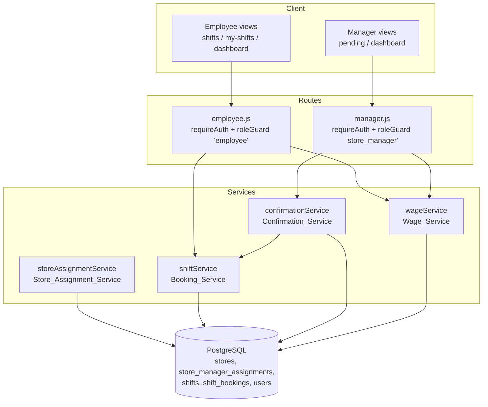
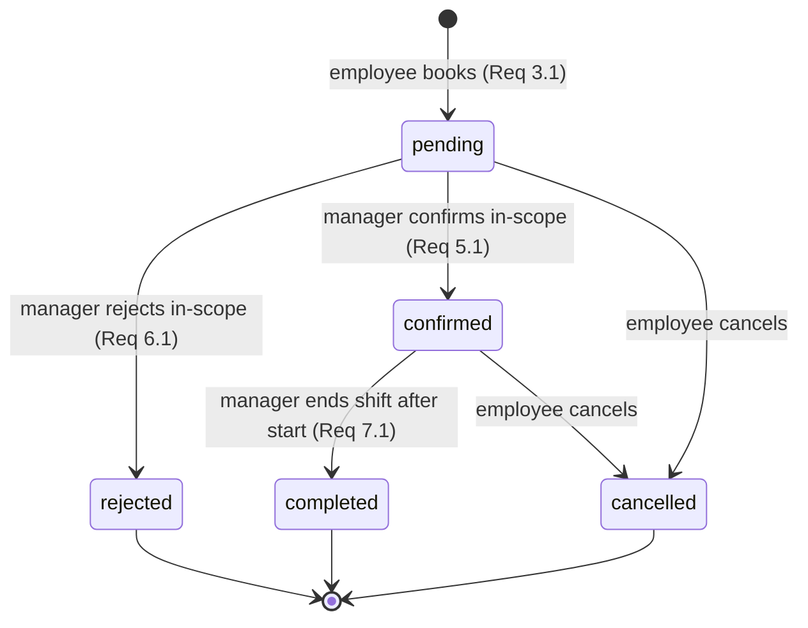

# Design Document

## Overview

This feature adds a manager-mediated approval workflow to the existing Employee
Management System (Express + EJS + PostgreSQL). It introduces a first-class
**Store** entity with manager ownership, routes employee booking requests to the
managers of the owning store, replaces the current "book straight to confirmed"
behavior with a `pending → confirmed/rejected` approval lifecycle, lets managers
end (complete) in-scope shifts, and surfaces earned wages on both the manager and
employee dashboards.

The design deliberately stays close to existing conventions:

- Business logic lives in `src/services/*.js` as plain async functions that take
  primitives/ids and return either domain objects or `{ success, error }`
  result objects (see `shiftService.bookShift`).
- Routes in `src/routes/*.js` are thin: they apply `requireAuth` + `roleGuard`,
  call a service, and either redirect or render an EJS view.
- All SQL uses parameterized queries through the shared `pool` from
  `src/config/database.js`. Multi-step state changes that depend on capacity use
  a transaction with `SELECT ... FOR UPDATE` row locking, exactly as
  `bookShift` already does.
- Views are server-rendered EJS with the existing inline-style structure and
  status CSS classes (`.status-confirmed`, etc.).

### Requirements addressed

This design covers Requirements 1–12 in `requirements.md`: Store entity and
manager assignment (1), shift ownership by store (2), pending booking creation
and routing (3), manager pending queue (4), confirm (5), reject (6), end shift
(7), wage calculation on completion (8), wage display on manager (9) and employee
(10) dashboards, employee booking-status visibility (11), and authorization for
manager actions (12).

### Key design decisions

1. **New `stores` and `store_manager_assignments` tables, plus `shifts.store_id`.**
   The current `shifts.store_location` free-text column cannot express ownership
   or routing. A nullable `store_id` foreign key is added so legacy shifts
   (no store) still exist but are excluded from confirmation queues
   (Requirement 2.3). `store_location` is retained for backward compatibility and
   display continuity.

2. **Booking lifecycle expands to `pending`, `confirmed`, `rejected`,
   `completed`, `cancelled`, `no_show`.** The existing CHECK constraint and the
   `confirmed`-only unique index are migrated. Bookings are created as `pending`
   (Requirement 3.1) instead of `confirmed`.

3. **Occupied capacity = count of `pending` + `confirmed` bookings.** This single
   rule (Requirement 3.5) drives capacity checks at booking time (3.6),
   confirmation time (5.5), and the freeing of a slot on rejection (6.5).

4. **Separation of `Booking_Service` and `Confirmation_Service`.** A new
   `confirmationService.js` owns manager decisions (confirm/reject) and the
   pending queue; `shiftService.js` (the existing `Booking_Service`) is extended
   for pending creation, ending shifts, and status-inclusive listings. This keeps
   employee-facing booking concerns separate from manager decision concerns.

5. **Wages are computed deterministically from completed bookings at read time.**
   Earned wage is a pure function of shift start/end and the employee's hourly
   wage, so no separate wage-run trigger is required (Requirement 8.1). Only
   `completed` bookings contribute. This mirrors the existing `wageService`
   approach and avoids storing a denormalized wage that could drift.

6. **Store creation and manager assignment are exposed through a service**
   (`storeAssignmentService.js`) consumed by an admin/seed script. The current
   role model has no `admin` role, so administrative assignment is performed via a
   script (like `scripts/seed-data.js`) rather than a new authenticated UI. The
   service enforces all validation rules (Requirement 1.5–1.8) regardless of
   caller. This is called out for review below.

## Architecture

The feature spans the existing layered architecture: EJS views → Express routes
(auth + role guard) → services → PostgreSQL via the connection pool.



### Booking lifecycle



`pending` and `confirmed` both occupy capacity (Req 3.5). Transitioning out of
those states (reject/cancel) frees a slot (Req 6.5). `completed` triggers wage
inclusion (Req 8.4).

### Booking request routing

```mermaid
sequenceDiagram
  participant E as Employee
  participant ER as employee.js
  participant SS as shiftService
  participant DB as PostgreSQL
  E->>ER: POST /employee/book {shiftId}
  ER->>SS: bookShift(employeeId, shiftId)
  SS->>DB: BEGIN; lock shift; validate (future, dup, capacity)
  SS->>DB: INSERT booking status='pending'
  SS->>DB: SELECT managers assigned to shift.store_id
  SS->>DB: COMMIT
  SS-->>ER: { success, routedManagerIds }
  ER-->>E: redirect /employee/my-shifts
```

Routing (Requirement 3.2) resolves the set of managers assigned to the shift's
owning store. The pending request becomes visible in those managers' queues; no
push notification is implied — visibility is pull-based through the queue query
(Requirement 4.1).

## Components and Interfaces

### Store_Assignment_Service — `src/services/storeAssignmentService.js` (new)

```js
// Create a store. Requirement 1.1
// returns { success: true, store: { id, name } } | { success:false, error }
async function createStore(name)

// Assign a manager to a store. Requirements 1.2–1.8
// Validates target role is 'store_manager' (1.5), role resolvable (1.6),
// store exists (1.7); idempotent on (managerId, storeId) pair (1.8).
// returns { success:true } | { success:false, error }
async function assignManagerToStore(managerId, storeId)

// Stores managed by a given manager. Used for scope checks.
// returns Array<{ id, name }>
async function getManagedStores(managerId)

// True if the manager is assigned to the store that owns the booking's shift.
// Requirement 12.2 scope helper.
// returns boolean
async function managerOwnsBooking(managerId, bookingId)
```

Validation logic is split into a pure helper so it can be property-tested without
a database:

```js
// Pure. Returns { valid:true } | { valid:false, error } given resolved facts.
function validateAssignment({ targetRole, storeExists })
```

### Booking_Service — `src/services/shiftService.js` (extended)

```js
// EXISTING, modified: create booking as 'pending' and route to store managers.
// Requirements 3.1–3.6. Now also returns routedManagerIds.
async function bookShift(employeeId, shiftId)

// EXISTING, modified: include owning store id per shift. Requirement 2.2.
async function getAvailableShifts(startDate, endDate)

// EXISTING, modified: include booking_status for every booking. Req 11.1, 11.2.
async function getEmployeeShifts(employeeId, startDate, endDate)

// NEW: manager ends a confirmed, in-scope shift -> 'completed'.
// Requirements 7.1–7.5. Records completed_by_manager_id + completed_at.
// returns { success:true } | { success:false, status:403, error } | { success:false, error }
async function endShift(managerId, bookingId)
```

Pure helpers extracted for property testing:

```js
// Occupied capacity rule. Requirement 3.5.
function occupiedCount(bookings) // count where status in ('pending','confirmed')

// Booking precondition check. Requirements 3.3, 3.4, 3.6.
function validateBookingRequest({ shiftStartTime, now, capacity, occupied, employeeHasActiveBooking })

// End-shift transition guard. Requirements 7.4, 7.5.
function validateEndShift({ status, shiftStartTime, now })
```

### Confirmation_Service — `src/services/confirmationService.js` (new)

```js
// Pending requests in scope for a manager. Requirements 4.1–4.3.
// returns { hasManagedStore:boolean, requests:Array<{ bookingId, employeeName,
//           shiftStartTime, shiftEndTime, storeId }> }
async function getPendingRequests(managerId)

// Confirm an in-scope pending booking. Requirements 5.1–5.5, 12.1, 12.2.
// returns { success:true } | { success:false, status:403, error } | { success:false, error }
async function confirmBooking(managerId, managerRole, bookingId)

// Reject an in-scope pending booking. Requirements 6.1–6.5, 12.1, 12.2.
async function rejectBooking(managerId, managerRole, bookingId)
```

Pure helpers:

```js
// Authorization decision. Requirements 12.1, 12.2, 5.3, 6.3, 7.3.
// returns { allowed:true } | { allowed:false, status:403, error }
function authorizeManagerAction({ role, isInScope })

// Decision transition guard. Requirements 5.4, 6.4, 5.5.
function validateDecision({ action, status, confirmedCount, capacity })
```

### Wage_Service — `src/services/wageService.js` (extended)

```js
// EXISTING, reused for manager dashboard scoping. Requirements 9.1–9.3.
// NEW wrapper scoping to a manager's managed stores.
async function getManagerWageEntries(managerId)  // in-scope completed bookings

// NEW: employee's own completed-booking wages. Requirements 10.1–10.3.
async function getEmployeeWageEntries(employeeId)
```

Pure helpers (the heart of the PBT surface):

```js
// Worked hours = (end - start) in hours. Requirement 8.2.
function workedHours(startTime, endTime)

// Earned wage = round(hours * hourlyWage, 2). Requirements 8.1–8.3.
// returns { ok:true, wage } | { ok:false, error } when hourlyWage not positive (8.5).
function earnedWage(startTime, endTime, hourlyWage)

// Sum of earned wages across entries. Requirements 9.3, 10.3.
function totalWage(entries)
```

### Routes

`src/routes/manager.js` (extended, already guarded by
`roleGuard('store_manager')` so Requirement 12.1 is enforced at the route layer):

- `GET /manager/pending` → `confirmationService.getPendingRequests` →
  render `manager/pending`.
- `POST /manager/confirm` `{ bookingId }` → `confirmBooking`; 403 → `res.status(403)`.
- `POST /manager/reject` `{ bookingId }` → `rejectBooking`.
- `POST /manager/end-shift` `{ bookingId }` → `shiftService.endShift`.
- `GET /manager/dashboard` → now loads `getManagerWageEntries` and renders wage
  table + total (Requirements 9.1–9.4).

`src/routes/employee.js` (extended):

- `POST /employee/book` → unchanged entry point; `bookShift` now creates pending.
- `GET /employee/dashboard` → loads `getEmployeeWageEntries` and renders wage
  table + total (Requirements 10.1–10.4).
- `GET /employee/my-shifts` → now displays all statuses (Requirement 11.x).

Unauthenticated access to any of these is redirected to `/login` by the existing
`requireAuth` middleware (Requirement 12.3).

### Views

- `src/views/manager/pending.ejs` (new): table of pending requests (employee
  name, start, end, store) with confirm/reject forms; "no store assigned"
  message when `hasManagedStore` is false (Requirement 4.3).
- `src/views/manager/dashboard.ejs` (modified): wage entries table (employee,
  date, hours, amount), total row, and empty-state message (Requirement 9.x).
- `src/views/employee/dashboard.ejs` (modified): wage entries table (date, hours,
  amount), total, empty-state message (Requirement 10.x).
- `src/views/employee/my-shifts.ejs` (modified): add status CSS classes for
  `pending` and `rejected`; an "End shift" action is manager-side only.

## Data Models

A migration script (`scripts/migrate-shift-confirmation.js`, following the
`scripts/init-db.js` style) applies the following changes. `IF NOT EXISTS` guards
keep it idempotent.

### New table: `stores` (Requirement 1.1)

```sql
CREATE TABLE IF NOT EXISTS stores (
  id UUID PRIMARY KEY DEFAULT gen_random_uuid(),
  name VARCHAR(100) NOT NULL,
  created_at TIMESTAMP DEFAULT CURRENT_TIMESTAMP
);
```

### New table: `store_manager_assignments` (Requirements 1.2–1.4, 1.8)

```sql
CREATE TABLE IF NOT EXISTS store_manager_assignments (
  id UUID PRIMARY KEY DEFAULT gen_random_uuid(),
  store_id UUID NOT NULL REFERENCES stores(id) ON DELETE CASCADE,
  manager_id UUID NOT NULL REFERENCES users(id) ON DELETE CASCADE,
  assigned_at TIMESTAMP DEFAULT CURRENT_TIMESTAMP,
  CONSTRAINT unique_store_manager UNIQUE (store_id, manager_id)  -- idempotence (1.8)
);
CREATE INDEX IF NOT EXISTS idx_sma_manager ON store_manager_assignments(manager_id);
CREATE INDEX IF NOT EXISTS idx_sma_store ON store_manager_assignments(store_id);
```

The `UNIQUE (store_id, manager_id)` constraint guarantees exactly one association
per pair; assignment uses `INSERT ... ON CONFLICT DO NOTHING` to stay idempotent
(Requirement 1.8). A many-to-many join table satisfies 1.3 and 1.4.

### Altered table: `shifts` (Requirement 2.1, 2.3)

```sql
ALTER TABLE shifts ADD COLUMN IF NOT EXISTS store_id UUID REFERENCES stores(id);
CREATE INDEX IF NOT EXISTS idx_shifts_store ON shifts(store_id);
```

`store_id` is nullable so pre-existing shifts remain valid; shifts with
`store_id IS NULL` are excluded from confirmation queues and returned only in
administrative listings (Requirement 2.3).

### Altered table: `shift_bookings` (Requirements 3.1, 5.2, 6.2, 7.2)

```sql
-- Expand allowed statuses to include 'pending' and 'rejected'.
ALTER TABLE shift_bookings DROP CONSTRAINT IF EXISTS shift_bookings_booking_status_check;
ALTER TABLE shift_bookings ADD CONSTRAINT shift_bookings_booking_status_check
  CHECK (booking_status IN ('pending','confirmed','rejected','completed','cancelled','no_show'));

-- Decision / completion audit columns.
ALTER TABLE shift_bookings ADD COLUMN IF NOT EXISTS decided_by_manager_id UUID REFERENCES users(id);
ALTER TABLE shift_bookings ADD COLUMN IF NOT EXISTS decided_at TIMESTAMP;            -- confirm/reject (5.2, 6.2)
ALTER TABLE shift_bookings ADD COLUMN IF NOT EXISTS completed_by_manager_id UUID REFERENCES users(id);
ALTER TABLE shift_bookings ADD COLUMN IF NOT EXISTS completed_at TIMESTAMP;          -- end shift (7.2)

-- Capacity now counts pending + confirmed, so prevent duplicate active bookings
-- for the same (shift, employee) across both states (Requirement 3.3).
DROP INDEX IF EXISTS idx_unique_confirmed_booking;
CREATE UNIQUE INDEX IF NOT EXISTS idx_unique_active_booking
  ON shift_bookings(shift_id, employee_id)
  WHERE booking_status IN ('pending','confirmed');
```

### Domain object shapes (service return values)

```
Store            = { id, name }
PendingRequest   = { bookingId, employeeName, shiftStartTime, shiftEndTime, storeId }
WageEntry        = { bookingId, employeeId, employeeName, date, hoursWorked, wageEarned }
EmployeeBooking  = { id, startTime, endTime, storeLocation, storeId, capacity,
                     bookingStatus, bookedAt }
```

`bookingStatus` is one of the six `Booking_Status` values. Per Requirement 11.3,
if status is temporarily unavailable the booking is still returned with
`bookingStatus` set to `null` rather than being omitted.

## Correctness Properties

*A property is a characteristic or behavior that should hold true across all
valid executions of a system — essentially, a formal statement about what the
system should do. Properties serve as the bridge between human-readable
specifications and machine-verifiable correctness guarantees.*

The properties below target the pure business-logic helpers identified in
Components and Interfaces (`occupiedCount`, `validateBookingRequest`,
`validateDecision`, `validateEndShift`, `authorizeManagerAction`,
`validateAssignment`, `workedHours`, `earnedWage`, `totalWage`, and the
projection/filtering of queue and wage entries). These helpers are deliberately
factored out from database access so they can be exercised with generated inputs.
Database-bound and UI-only criteria (1.1–1.4, 4.3, 5.2, 6.2, 7.2, 9.4, 10.4,
12.3) are covered by example/integration/smoke tests in the Testing Strategy.

### Property 1: New bookings are created as pending

*For any* booking request that passes all preconditions (shift start in the
future, no existing active booking by the employee, occupied capacity below
shift capacity), the created booking's status is `pending`.

**Validates: Requirements 3.1**

### Property 2: Pending requests route to exactly the owning store's managers

*For any* store-to-manager assignment configuration and any shift owned by a
store, the set of managers a new pending request is routed to equals exactly the
set of managers assigned to that store.

**Validates: Requirements 3.2**

### Property 3: Duplicate active bookings are rejected without state change

*For any* shift for which an employee already has an active (`pending` or
`confirmed`) booking, a further booking request by that same employee is rejected
with an "already exists" error and the booking set is unchanged.

**Validates: Requirements 3.3**

### Property 4: Past or current shifts cannot be booked

*For any* shift whose start time is less than or equal to the current time, a
booking request is rejected with a past/current-shift error; when the start time
is strictly in the future and other preconditions hold, the request is accepted.

**Validates: Requirements 3.4**

### Property 5: Occupied capacity counts pending and confirmed, and full shifts reject

*For any* multiset of bookings on a shift, the occupied count equals the number of
bookings whose status is `pending` or `confirmed`; and *for any* shift whose
occupied count is greater than or equal to its capacity, a new booking request is
rejected with a full-capacity error.

**Validates: Requirements 3.5, 3.6**

### Property 6: Available shifts expose their owning store id

*For any* set of available shifts returned to an employee, every returned shift
record includes the owning store id equal to the shift's stored `store_id`.

**Validates: Requirements 2.2**

### Property 7: Storeless shifts are excluded from confirmation queues

*For any* mixture of bookings whose shifts may or may not have an owning store,
the manager pending queue contains no booking whose shift has no associated store.

**Validates: Requirements 2.3**

### Property 8: The pending queue returns exactly the in-scope pending bookings, with required fields

*For any* set of bookings and any manager, the pending queue returns precisely
those bookings that are `pending` and whose owning store is managed by that
manager (no in-scope pending omitted, nothing out-of-scope or non-pending
included), and each returned request includes the employee name, shift start
time, shift end time, and owning store id.

**Validates: Requirements 4.1, 4.2**

### Property 9: Manager actions are authorized only for store_manager role and in-scope bookings

*For any* role and scope flag, a manager confirmation/rejection/end action is
allowed only when the role is `store_manager` and the booking is in scope;
otherwise it is denied with a `403` authorization error.

**Validates: Requirements 5.3, 6.3, 7.3, 12.1, 12.2**

### Property 10: Only pending bookings can be confirmed or rejected

*For any* booking whose status is not `pending`, a confirm or reject decision is
rejected with an error stating only pending bookings can be confirmed/rejected;
when the status is `pending` (and, for confirm, capacity allows), the decision is
allowed.

**Validates: Requirements 5.4, 6.4**

### Property 11: Confirming cannot exceed shift capacity

*For any* shift whose confirmed-booking count is greater than or equal to its
capacity, confirming a further pending booking is rejected with a full-capacity
error.

**Validates: Requirements 5.5**

### Property 12: Confirm and reject perform their state transition

*For any* in-scope `pending` booking, confirming sets its status to `confirmed`
(when capacity allows) and rejecting sets its status to `rejected`.

**Validates: Requirements 5.1, 6.1**

### Property 13: Rejecting a pending booking frees exactly one capacity slot

*For any* booking set containing a `pending` booking on a shift, transitioning
that booking to `rejected` decreases the shift's occupied count by exactly one.

**Validates: Requirements 6.5**

### Property 14: Ending a shift requires a confirmed, already-started booking

*For any* booking, ending the shift is allowed only when the booking status is
`confirmed` and the shift start time is less than or equal to the current time;
a non-`confirmed` status yields an "only confirmed bookings can be ended" error
and a future start time yields a "cannot end before it begins" error. When
allowed, the status becomes `completed`.

**Validates: Requirements 7.1, 7.4, 7.5**

### Property 15: Earned wage equals rounded hours times hourly wage

*For any* shift with start strictly before end and any positive hourly wage, the
earned wage equals `round(((end - start) in hours) * hourlyWage, 2)`, and worked
hours equals the difference between end and start expressed in hours.

**Validates: Requirements 8.1, 8.2, 8.3**

### Property 16: Only completed bookings contribute to wage results

*For any* set of bookings of mixed status, the wage results include an entry for
exactly the `completed` bookings and no others.

**Validates: Requirements 8.4**

### Property 17: Non-positive hourly wage is excluded and reported

*For any* booking whose employee's hourly wage is not a positive number, the
booking is excluded from wage results and an error identifying that employee is
returned.

**Validates: Requirements 8.5**

### Property 18: Wage entries are listed in full (including zero) with required fields

*For any* set of in-scope `completed` bookings, the rendered wage list contains
one entry per booking (including entries whose earned wage is zero), and each
entry includes the employee name (manager view), the shift date, the worked
hours, and the earned wage amount.

**Validates: Requirements 9.1, 9.2, 10.1, 10.2**

### Property 19: Displayed total equals the sum of listed entries

*For any* set of wage entries, the displayed total earned wage equals the sum of
the earned wage amounts of the listed entries.

**Validates: Requirements 9.3, 10.3**

### Property 20: Booking listings preserve status for every booking and every status

*For any* set of an employee's bookings across all six statuses (`pending`,
`confirmed`, `rejected`, `completed`, `cancelled`, `no_show`), the listing returns
one record per booking, each including its booking status, with no booking
omitted by status.

**Validates: Requirements 11.1, 11.2**

### Property 21: Store-manager assignment is idempotent

*For any* (manager, store) pair, assigning that pair one or more times results in
exactly one association for the pair.

**Validates: Requirements 1.8**

### Property 22: Assignment is rejected for non-store_manager targets

*For any* target user whose resolved role is not `store_manager` (including an
undeterminable role), the assignment is rejected with an error identifying the
invalid or unvalidated role.

**Validates: Requirements 1.5, 1.6**

## Error Handling

The design follows the existing error conventions: services return
`{ success: false, error }` (or `{ success: false, status: 403, error }` for
authorization) rather than throwing for expected business failures, and routes
translate those into a re-rendered view with an `error` message or an HTTP status
code. Unexpected exceptions are caught, logged with the existing
`console.error('[Service] ... ', { error, stack })` shape, and surfaced as a
generic system-error result, matching `shiftService.bookShift`.

| Condition | Requirement | Handling |
|-----------|-------------|----------|
| Assignment to non-`store_manager` / undeterminable role | 1.5, 1.6 | `validateAssignment` returns invalid; service returns `{ success:false, error }` identifying the role |
| Assignment references missing store | 1.7 | Service checks existence; returns `{ success:false, error }` naming the missing store |
| Duplicate booking (active exists) | 3.3 | `INSERT ... WHERE NOT EXISTS` + unique index; returns "a booking already exists" |
| Past/current shift booking | 3.4 | Transaction validates start > now; returns past/current error |
| Shift at full capacity (book) | 3.6 | `FOR UPDATE` lock + occupied count; returns full-capacity error |
| Out-of-scope or wrong-role manager action | 5.3, 6.3, 7.3, 12.1, 12.2 | `authorizeManagerAction`; route responds `403` |
| Confirm/reject on non-pending | 5.4, 6.4 | `validateDecision`; returns "only pending" error |
| Confirm exceeding capacity | 5.5 | `FOR UPDATE` lock + confirmed count; returns full-capacity error |
| End non-confirmed / future shift | 7.4, 7.5 | `validateEndShift`; returns corresponding error |
| Non-positive hourly wage | 8.5 | `earnedWage` returns `{ ok:false, error }`; booking excluded, employee identified |
| Booking status temporarily unavailable | 11.3 | Map missing status to `bookingStatus: null`; booking still returned |
| Unauthenticated request | 12.3 | Existing `requireAuth` redirects to `/login` |
| Unexpected DB/system error | — | Transaction `ROLLBACK`, log with stack, return generic system-error result |

Concurrency: confirmation and booking both depend on capacity, so both wrap the
read-modify-write in a transaction and take `SELECT ... FOR UPDATE` on the shift
row before counting, preventing two concurrent confirms/bookings from exceeding
capacity (Requirements 3.6, 5.5).

## Testing Strategy

This feature has a substantial pure-logic core (capacity counting, status
transition guards, authorization decisions, wage arithmetic, idempotent
assignment), so property-based testing is appropriate for that layer.
Database-bound persistence, queue/wage SQL projections, and EJS rendering are
covered by example and integration tests.

### Test framework and tooling

- **Test runner**: Jest (already configured; `testMatch` is
  `**/src/**/*.test.js`). Tests live next to sources as `*.test.js`, matching the
  existing `authService.*.test.js` convention.
- **Property-based testing library**: `fast-check` (added as a devDependency).
  Property tests must not be hand-rolled.
- **Database isolation**: unit and property tests mock `../config/database` (the
  `pool.query` function) exactly as `authService.logout.test.js` does, so no live
  database is required. The pure helpers take plain values and need no mock.

### Property-based tests

- Each correctness property (1–22) is implemented by a **single** property-based
  test using `fast-check`, run with **at least 100 iterations**
  (`fc.assert(fc.property(...), { numRuns: 100 })`).
- Each property test is tagged with a comment referencing the design property:
  `// Feature: manager-shift-confirmation, Property {number}: {property text}`.
- Generators cover the edge cases noted in prework: empty booking sets, mixed
  status multisets, start/end boundary equality (`start == now`,
  `start == end`), zero and non-positive hourly wages, undeterminable roles
  (`null`/`undefined`), shifts with `null` store id, and repeat-count assignment
  sequences for idempotence.
- Suggested mapping of properties to files:
  - `shiftService.logic.test.js`: Properties 1, 3, 4, 5, 13 (booking + capacity
    helpers), 14 (end-shift guard), 20 (status-preserving listing model).
  - `confirmationService.logic.test.js`: Properties 9, 10, 11, 12.
  - `storeAssignmentService.logic.test.js`: Properties 21, 22.
  - `wageService.logic.test.js`: Properties 15, 16, 17, 18, 19.
  - `queue.projection.test.js`: Properties 2, 6, 7, 8.

### Example and edge-case unit tests

- Store/assignment CRUD (1.1–1.4): example tests with mocked `pool` asserting the
  parameterized SQL and returned shapes.
- Missing-store assignment (1.7) and undeterminable-role (1.6): edge-case tests.
- Audit recording on confirm/reject/end (5.2, 6.2, 7.2): example tests asserting
  `decided_by_manager_id`/`decided_at` and `completed_by_manager_id`/
  `completed_at` are written.
- Empty-state messaging (4.3, 9.4, 10.4): example tests on the service result and
  a render assertion.
- Status temporarily unavailable (11.3): edge-case test mapping missing status to
  `null` without dropping the booking.
- Unauthenticated redirect (12.3): covered by the existing `auth` middleware test
  pattern; add route-level smoke coverage for the new manager endpoints.

### Integration tests

- A migration smoke test that applies `scripts/migrate-shift-confirmation.js`
  against a test database and verifies the new tables/columns/constraints exist
  and that the expanded `booking_status` CHECK accepts `pending`/`rejected`.
- An end-to-end booking lifecycle test (book → pending → confirm → end →
  completed → wage appears) against a test database to validate the SQL and
  transaction wiring that the mocked unit tests cannot cover.
