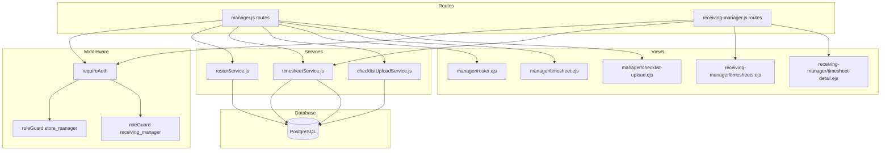
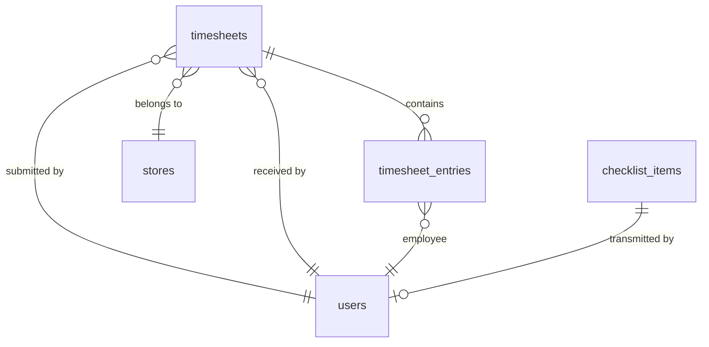

# Design Document: Roster & Timesheet Management

## Overview

This feature adds three core capabilities to the Employee Management System:

1. **Weekly Roster Generation** — Store managers view a Monday–Sunday roster of confirmed employee shift bookings for their assigned stores, with week navigation.
2. **Warehouse Checklist Upload** — Store managers transmit completed checklist items to the single warehouse manager, preventing duplicates and incomplete data.
3. **Timesheet Generation & Submission** — Store managers generate weekly timesheets summarizing completed shift hours and submit them to a new `receiving_manager` role for payroll processing.

The design follows existing conventions: Express route files guarded by `requireAuth` + `roleGuard`, service modules with pure validation helpers separated from database operations, parameterized PostgreSQL queries via the shared `pool`, and EJS server-rendered views.

## Architecture



### Request Flow

1. Browser → Express route (with auth + role middleware)
2. Route handler calls service function
3. Service performs pure validation, then database operations
4. Service returns result object `{ success, data?, error? }`
5. Route renders EJS view or redirects

### Key Design Decisions

| Decision | Rationale |
|----------|-----------|
| New `receiving_manager` role added to users table CHECK constraint | Follows existing role pattern; single-role-per-user model |
| Separate `timesheets` + `timesheet_entries` tables | Persisted timesheets enable auditing and prevent re-submission |
| `transmitted_at` column on `checklist_items` | Lightweight flag avoids a separate join table for upload tracking |
| Pure helper functions for week calculation and validation | Enables property-based testing without database dependencies |
| Store isolation via JOIN to `store_manager_assignments` | Matches existing pattern in confirmationService and shiftService |

## Components and Interfaces

### 1. rosterService.js

Handles weekly roster generation with store isolation.

```javascript
/**
 * Pure: Calculate the Monday-Sunday Roster_Week containing a given date.
 * @param {Date} date - Any date within the desired week
 * @returns {{ start: Date, end: Date }} Monday 00:00:00 to Sunday 23:59:59
 */
function getRosterWeek(date)

/**
 * Pure: Validate a roster request.
 * @param {{ date: string|null, hasManagedStore: boolean }} facts
 * @returns {{ valid: true, week: { start: Date, end: Date } } | { valid: false, error: string }}
 */
function validateRosterRequest(facts)

/**
 * Fetch confirmed bookings for a manager's stores during a Roster_Week.
 * @param {string} managerId
 * @param {Date} weekStart - Monday 00:00:00
 * @param {Date} weekEnd - Sunday 23:59:59
 * @returns {Promise<{ hasManagedStore: boolean, roster: Array<RosterEntry> }>}
 */
async function getRoster(managerId, weekStart, weekEnd)
```

### 2. timesheetService.js

Handles timesheet generation, submission, and retrieval.

```javascript
/**
 * Pure: Compute hours between two timestamps, rounded to 2 decimal places.
 * @param {Date} startTime
 * @param {Date} endTime
 * @returns {number}
 */
function computeHours(startTime, endTime)

/**
 * Pure: Validate timesheet submission preconditions.
 * @param {{ weekEnd: Date, now: Date, hasCompletedBookings: boolean, alreadySubmitted: boolean, hasReceivingManager: boolean, hasStore: boolean }} facts
 * @returns {{ valid: true } | { valid: false, error: string }}
 */
function validateTimesheetSubmission(facts)

/**
 * Generate a timesheet for a manager's store for a given Roster_Week.
 * @param {string} managerId
 * @param {Date} weekStart
 * @param {Date} weekEnd
 * @returns {Promise<{ success: boolean, timesheet?: TimesheetData, error?: string }>}
 */
async function generateTimesheet(managerId, weekStart, weekEnd)

/**
 * Submit a generated timesheet to the receiving manager.
 * @param {string} managerId
 * @param {Date} weekStart
 * @param {Date} weekEnd
 * @returns {Promise<{ success: boolean, error?: string }>}
 */
async function submitTimesheet(managerId, weekStart, weekEnd)

/**
 * List submitted timesheets (for receiving manager), paginated.
 * @param {number} page - 1-indexed
 * @param {number} limit - Max 50
 * @returns {Promise<{ timesheets: Array<TimesheetSummary>, total: number }>}
 */
async function getSubmittedTimesheets(page, limit)

/**
 * Get detailed timesheet entries for a specific submitted timesheet.
 * @param {string} timesheetId
 * @returns {Promise<{ success: boolean, timesheet?: TimesheetDetail, error?: string }>}
 */
async function getTimesheetDetail(timesheetId)
```

### 3. checklistUploadService.js

Handles transmission of completed checklist items to the warehouse manager.

```javascript
/**
 * Pure: Validate whether a checklist upload can proceed.
 * @param {{ hasPendingItems: boolean, hasCompletedItems: boolean, hasWarehouseManager: boolean, hasStore: boolean }} facts
 * @returns {{ valid: true } | { valid: false, error: string }}
 */
function validateChecklistUpload(facts)

/**
 * Upload completed (non-pending, non-transmitted) checklist items to the warehouse manager.
 * @param {string} managerId
 * @returns {Promise<{ success: boolean, uploadedCount?: number, error?: string }>}
 */
async function uploadChecklist(managerId)
```

### 4. Routes

**Manager routes** (added to existing `src/routes/manager.js` or new sub-router):
- `GET /manager/roster` — View roster for current or specified week
- `GET /manager/roster?date=YYYY-MM-DD` — View roster for week containing date
- `GET /manager/timesheet` — View/generate timesheet for current or specified week
- `GET /manager/timesheet?date=YYYY-MM-DD` — View timesheet for week containing date
- `POST /manager/timesheet/submit` — Submit timesheet to receiving manager
- `GET /manager/checklist-upload` — View uploadable checklist items
- `POST /manager/checklist-upload` — Upload checklist items to warehouse manager

**Receiving Manager routes** (new `src/routes/receiving-manager.js`):
- `GET /receiving-manager/dashboard` — Dashboard view
- `GET /receiving-manager/timesheets` — List submitted timesheets (paginated)
- `GET /receiving-manager/timesheets/:id` — View timesheet detail

### 5. Middleware Changes

- Update `roleGuard` to accept `'receiving_manager'` as a valid role (no code change needed — it already takes a string parameter)
- Add `receiving_manager` route registration in `app.js`
- Update root redirect in `app.js` to handle `receiving_manager` role

## Data Models

### New Tables

#### `timesheets`

| Column | Type | Constraints | Description |
|--------|------|-------------|-------------|
| id | UUID | PK, DEFAULT gen_random_uuid() | Unique timesheet identifier |
| store_id | UUID | FK → stores(id), NOT NULL | Store this timesheet belongs to |
| week_start | DATE | NOT NULL | Monday of the Roster_Week |
| week_end | DATE | NOT NULL | Sunday of the Roster_Week |
| total_hours | NUMERIC(10,2) | NOT NULL | Sum of all employee hours |
| employee_count | INTEGER | NOT NULL | Number of employees in timesheet |
| submitted_by | UUID | FK → users(id), NOT NULL | Store manager who submitted |
| received_by | UUID | FK → users(id), NOT NULL | Receiving manager |
| submitted_at | TIMESTAMP | DEFAULT CURRENT_TIMESTAMP | Submission timestamp |
| status | VARCHAR(20) | CHECK IN ('submitted', 'reviewed') | Timesheet status |

**Constraints:**
- `UNIQUE(store_id, week_start)` — Prevents duplicate submissions for same store/week

#### `timesheet_entries`

| Column | Type | Constraints | Description |
|--------|------|-------------|-------------|
| id | UUID | PK, DEFAULT gen_random_uuid() | Entry identifier |
| timesheet_id | UUID | FK → timesheets(id) ON DELETE CASCADE | Parent timesheet |
| employee_id | UUID | FK → users(id) | Employee reference |
| shift_date | DATE | NOT NULL | Date of the shift |
| shift_start | TIMESTAMP | NOT NULL | Shift start time |
| shift_end | TIMESTAMP | NOT NULL | Shift end time |
| hours_worked | NUMERIC(10,2) | NOT NULL | Hours for this entry |

### Schema Modifications

#### `checklist_items` — Add column

| Column | Type | Default | Description |
|--------|------|---------|-------------|
| transmitted_at | TIMESTAMP | NULL | When the item was uploaded to warehouse manager |
| transmitted_by | UUID | FK → users(id), NULL | Manager who initiated the upload |

#### `users` — Modify role CHECK constraint

```sql
ALTER TABLE users DROP CONSTRAINT IF EXISTS users_role_check;
ALTER TABLE users ADD CONSTRAINT users_role_check
  CHECK (role IN ('employee', 'store_manager', 'warehouse_manager', 'receiving_manager'));
```

### Entity Relationship (New Tables)




## Correctness Properties

*A property is a characteristic or behavior that should hold true across all valid executions of a system — essentially, a formal statement about what the system should do. Properties serve as the bridge between human-readable specifications and machine-verifiable correctness guarantees.*

### Property 1: Roster Week Calculation

*For any* date, the `getRosterWeek` function SHALL return a week where the start date is a Monday (day-of-week = 1) at 00:00:00 and the end date is a Sunday (day-of-week = 0) at 23:59:59, and the input date falls within the inclusive range [start, end].

**Validates: Requirements 1.2**

### Property 2: Roster Store Isolation and Status Filter

*For any* store manager and any set of shift bookings across multiple stores and statuses, the roster SHALL contain only bookings where (a) the shift's `store_id` is in the set of the manager's assigned stores AND (b) the `booking_status` is `'confirmed'`. No booking from an unassigned store or with a non-confirmed status shall appear.

**Validates: Requirements 1.1, 1.3, 1.6, 2.1, 2.2**

### Property 3: Roster Ordering Invariant

*For any* roster result containing multiple employees and/or multiple shifts per employee, employees SHALL be ordered alphabetically by (last_name, first_name), and within each employee, shifts SHALL be ordered chronologically by start_time.

**Validates: Requirements 1.4**

### Property 4: Invalid Date Rejection

*For any* string that does not represent a valid date (null, empty, malformed, non-date strings), the `validateRosterRequest` function SHALL return `{ valid: false }` with an error message.

**Validates: Requirements 1.8**

### Property 5: Week Navigation Arithmetic

*For any* valid Roster_Week with start date M (Monday), requesting the previous week SHALL yield a week starting on M - 7 days, and requesting the next week SHALL yield a week starting on M + 7 days. Both resulting weeks SHALL satisfy Property 1 (start is Monday, end is Sunday).

**Validates: Requirements 3.2, 3.3**

### Property 6: Navigation Boundary Enforcement

*For any* current date, navigation SHALL be permitted for at most 12 weeks into the past and 12 weeks into the future. For any week beyond these bounds, the navigation control SHALL be disabled (indicated by a boundary flag).

**Validates: Requirements 3.6**

### Property 7: Checklist Upload Filtering

*For any* set of checklist items with varying statuses and `transmitted_at` values, the upload service SHALL retrieve only items where (a) status is in ('arrived', 'missing', 'partial'), (b) `transmitted_at` IS NULL, and (c) the item belongs to the manager's assigned store. Items already transmitted or with status 'pending' SHALL be excluded.

**Validates: Requirements 4.1, 4.6, 4.7**

### Property 8: Checklist Upload Validation (Pending Rejection)

*For any* checklist where at least one item has status `'pending'`, the upload SHALL be rejected, and no item's `transmitted_at` or state SHALL be modified. Conversely, for any checklist where all items have status in ('arrived', 'missing', 'partial'), the upload SHALL be accepted.

**Validates: Requirements 5.1, 5.2**

### Property 9: Hours Computation

*For any* pair of timestamps (start_time, end_time) where end_time > start_time, `computeHours(start_time, end_time)` SHALL return a value equal to `(end_time - start_time) / 3_600_000` rounded to exactly 2 decimal places.

**Validates: Requirements 6.2**

### Property 10: Timesheet Aggregation Correctness

*For any* set of completed bookings grouped by employee, the total weekly hours for each employee SHALL equal the sum of the individual `computeHours` results for that employee's bookings, and the timesheet total SHALL equal the sum of all employee totals.

**Validates: Requirements 6.1, 6.3**

### Property 11: Timesheet Store Isolation

*For any* store manager and any set of completed bookings across multiple stores, the timesheet SHALL include only bookings where the shift's `store_id` matches the manager's assigned store.

**Validates: Requirements 6.4**

### Property 12: Timesheet Submission Validation

*For any* timesheet submission attempt: (a) if the Roster_Week end date is in the future relative to now, submission SHALL be rejected; (b) if the timesheet contains zero completed bookings, submission SHALL be rejected; (c) if a timesheet for the same store and week has already been submitted, submission SHALL be rejected. All three conditions are checked by `validateTimesheetSubmission`.

**Validates: Requirements 7.4, 7.5, 7.6**

### Property 13: Single Active Receiving Manager

*For any* attempt to create or activate a user with role `'receiving_manager'` while an active receiving_manager already exists, the system SHALL reject the operation. At most one user with role `'receiving_manager'` and `is_active = true` SHALL exist at any time.

**Validates: Requirements 8.2, 8.3**

### Property 14: Timesheet List Ordering and Pagination

*For any* set of submitted timesheets, the listing SHALL return them ordered by `submitted_at` descending (most recent first), with at most 50 entries per page.

**Validates: Requirements 9.1**

## Error Handling

### Service-Level Errors

All services follow the existing `{ success: boolean, error?: string }` result-object pattern. No exceptions are thrown to route handlers for expected business failures.

| Error Condition | Service | Response |
|----------------|---------|----------|
| Manager not assigned to any store | rosterService, timesheetService | `{ success: false, error: 'No store assignment exists' }` |
| Invalid/missing date parameter | rosterService | `{ success: false, error: 'Invalid date: could not determine roster week' }` |
| No warehouse manager in system | checklistUploadService | `{ success: false, error: 'No warehouse manager available' }` |
| No receiving manager in system | timesheetService | `{ success: false, error: 'No receiving manager available' }` |
| Pending items in checklist | checklistUploadService | `{ success: false, error: 'All items must be completed before upload' }` |
| Duplicate timesheet submission | timesheetService | `{ success: false, error: 'Timesheet already submitted for this week' }` |
| Future week submission | timesheetService | `{ success: false, error: 'Cannot submit timesheet for future weeks' }` |
| Empty timesheet submission | timesheetService | `{ success: false, error: 'No completed shifts to submit' }` |
| Timesheet not found | timesheetService | `{ success: false, error: 'Timesheet not found' }` |
| Upload failure after validation | checklistUploadService | `{ success: false, error: 'Upload failed, please retry' }` (data preserved via ROLLBACK) |

### Route-Level Error Handling

- All route handlers wrap service calls in try/catch
- Caught errors log via `console.error` with context (matching existing pattern)
- User-facing errors render the relevant view with an `error` variable
- 403 responses use the existing `roleGuard` pattern

### Transaction Safety

- Checklist upload uses `BEGIN`/`COMMIT`/`ROLLBACK` to ensure atomicity (all items marked transmitted or none)
- Timesheet submission uses a transaction with `SELECT ... FOR UPDATE` on the unique constraint check to prevent race conditions on duplicate submission

## Testing Strategy

### Property-Based Testing

This feature contains significant pure logic (week calculation, hours computation, validation rules, filtering/sorting) that is well-suited to property-based testing.

**Library:** [fast-check](https://github.com/dubzzz/fast-check) (JavaScript property-based testing library)

**Configuration:**
- Minimum 100 iterations per property test
- Each property test references its design document property
- Tag format: `Feature: roster-timesheet-management, Property {number}: {title}`

**Property tests to implement:**

| Property | Pure Function Under Test | Key Generators |
|----------|------------------------|----------------|
| 1: Roster Week Calculation | `getRosterWeek(date)` | Arbitrary dates (Date objects) |
| 2: Store Isolation & Status Filter | `filterRosterBookings(bookings, assignedStoreIds)` | Arrays of booking objects with random store_ids and statuses |
| 3: Roster Ordering | `sortRosterEntries(entries)` | Arrays of employee/shift objects with random names and times |
| 4: Invalid Date Rejection | `validateRosterRequest(facts)` | Random non-date strings, null, undefined |
| 5: Week Navigation | `getRosterWeek(date ± 7 days)` | Arbitrary dates |
| 6: Navigation Boundary | `isWithinNavigationBounds(week, currentDate)` | Arbitrary date pairs |
| 7: Checklist Upload Filtering | `filterUploadableItems(items, storeId)` | Arrays of checklist items with random statuses and transmitted_at |
| 8: Checklist Validation | `validateChecklistUpload(facts)` | Objects with hasPendingItems boolean |
| 9: Hours Computation | `computeHours(start, end)` | Pairs of timestamps where end > start |
| 10: Timesheet Aggregation | `aggregateTimesheet(entries)` | Arrays of timesheet entry objects |
| 11: Timesheet Store Isolation | `filterTimesheetBookings(bookings, storeId)` | Arrays of booking objects with random store_ids |
| 12: Submission Validation | `validateTimesheetSubmission(facts)` | Objects with future/empty/duplicate flags |
| 13: Single Receiving Manager | `validateReceivingManagerCreation(existingCount)` | Random counts (0, 1, 2+) |
| 14: Timesheet List Ordering | `sortTimesheets(timesheets)` | Arrays of timesheet objects with random dates |

### Unit Tests (Example-Based)

- Manager with no store assignment gets empty roster (Req 1.5, 2.4)
- Empty week displays appropriate message (Req 1.7, 3.5)
- Default roster shows current week (Req 3.1)
- ISO 8601 date formatting (Req 3.4)
- No warehouse manager error (Req 4.3)
- No items to upload response (Req 4.4)
- Upload audit fields populated (Req 4.5)
- No checklist for today (Req 5.3)
- Upload failure preserves data (Req 5.4)
- Empty timesheet message (Req 6.5)
- No store assignment error (Req 6.6)
- Submission audit fields (Req 7.2)
- No receiving manager error (Req 7.3)
- Submission confirmation (Req 7.7)
- Receiving manager role exists (Req 8.1)
- Auth integration (Req 8.4)
- Timesheet access granted (Req 8.5)
- Route restriction 403s (Req 8.6)
- Empty timesheet list message (Req 9.4)
- Non-existent timesheet error (Req 9.5)

### Integration Tests

- Full roster flow: create bookings → generate roster → verify content
- Full timesheet flow: complete bookings → generate → submit → view as receiving manager
- Checklist upload flow: complete checklist items → upload → verify warehouse manager receives
- Auth flow: receiving_manager login → session → access control
- Performance: roster generation with 200 bookings < 3 seconds (Req 1.9)
